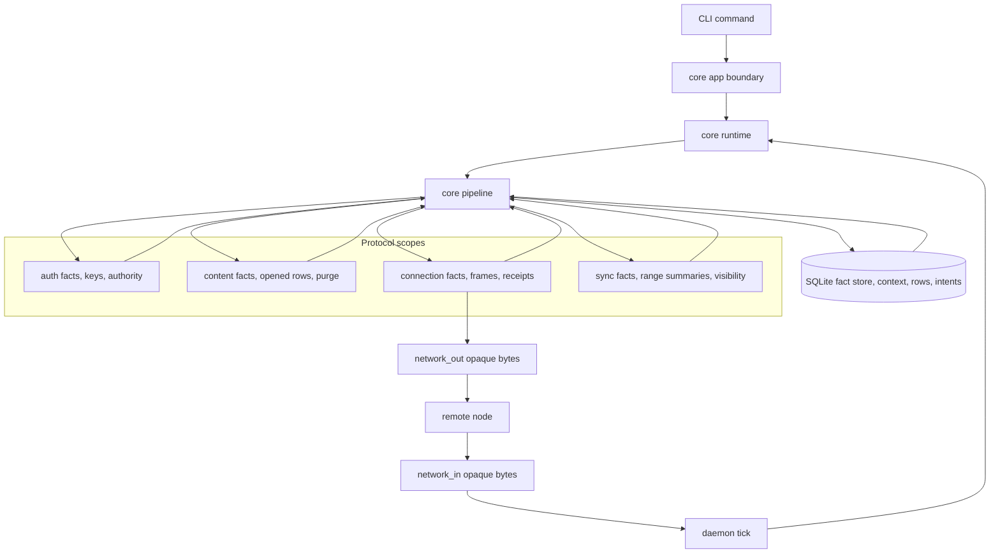
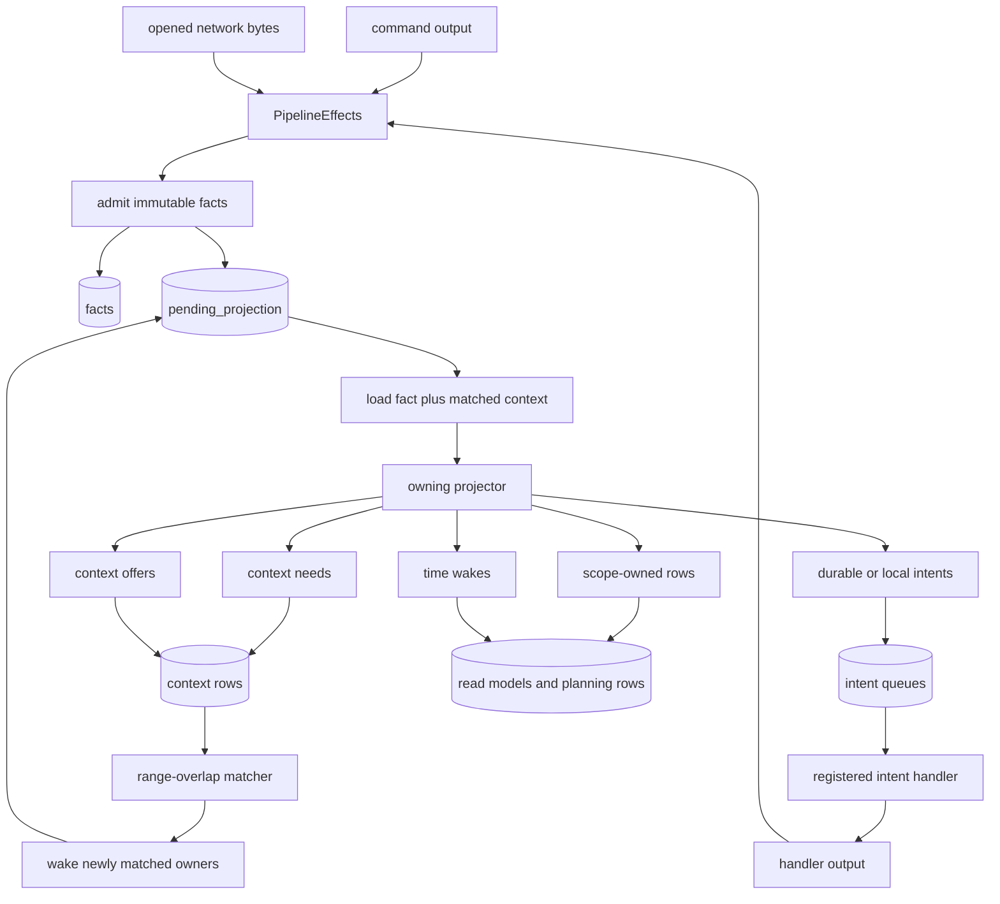
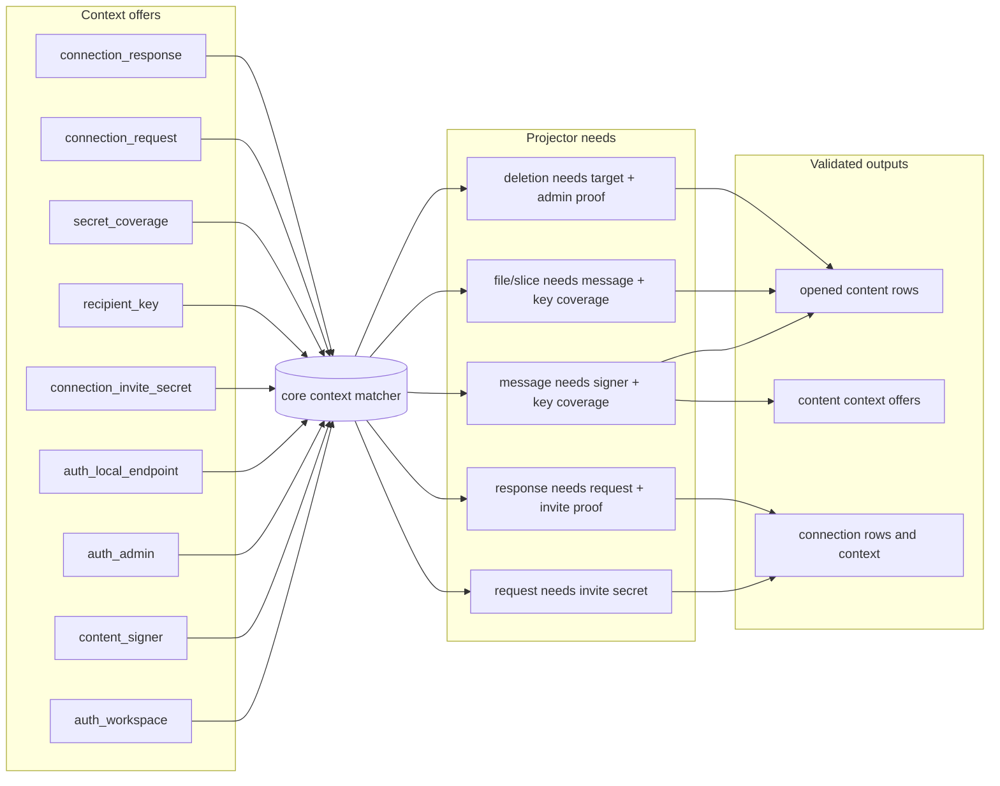
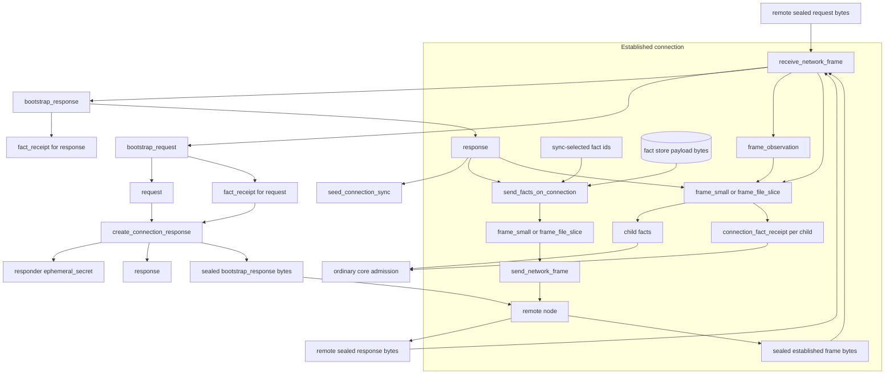
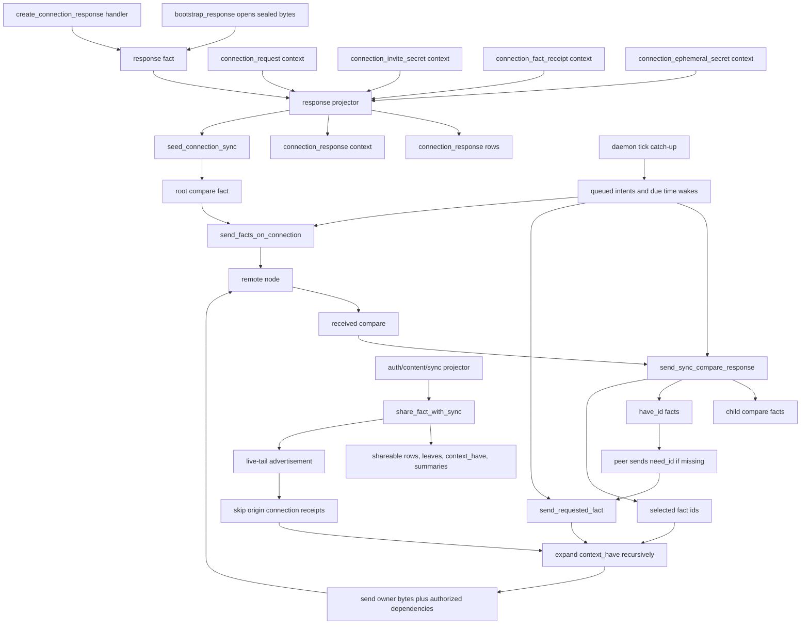
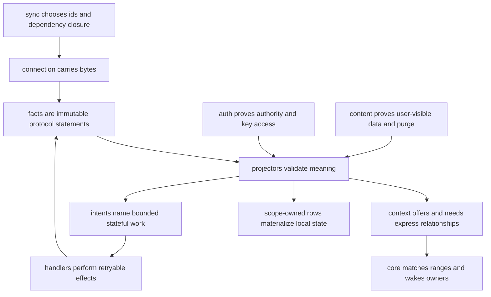

# Architecture Diagrams

These are GitHub-renderable Mermaid flowcharts for the current Context
architecture. They are a visual companion to `README.md`, `docs/RULES.md`, and
the scope READMEs; the Rust modules remain the source of truth.

## 0) Runtime Boundaries

Context has one protocol-neutral runtime and several protocol scopes. Core owns
fact admission, context matching, queue mechanics, transaction boundaries, and
opaque network bytes. Protocol scopes own fact meaning, projection, row
materialization, and bounded intent handlers.

## 1) Fact Admission And Context Matching

Facts enter from commands, received frames, and handlers. Projection emits the
complete standing needs and offers for the fact being projected. Context is a
range relationship: an offer can satisfy many needs, and an offer may exist
before a later fact creates the matching need.

## 2) Context As The Cross-Scope Interface

Cross-scope proof usually travels through context, not direct row reads.
Projectors publish role-scoped ranges; later projectors consume matched payload
facts through `ProjectionContext` and still validate them locally. This diagram
shows context as a proof surface; fact emission from bootstrap and frame opening
is shown in the connection flow below.

## 3) Connection Bootstrap And Established Frames

Connection owns sealed transport. Bootstrap wrappers are local receive facts
that preserve sealed bytes until projection can open them with local endpoint
context. Established frames carry ordinary fact bytes; once opened, child facts
return to core admission and their owning scope validates meaning.

## 4) Sync Seed, Live Tail, And Catch-Up

Sync plans replication over established connection facts. A connection response
becomes durable only after its projector validates request, invite, receipt,
and ephemeral-secret context. That projection emits `seed_connection_sync`,
which creates the first compare. Later share contributions live-tail to
established authorized connections. Periodic daemon ticks drain queued compare,
have, need, send, and time-wake work when catch-up remains.

## 5) Responsibility Summary

