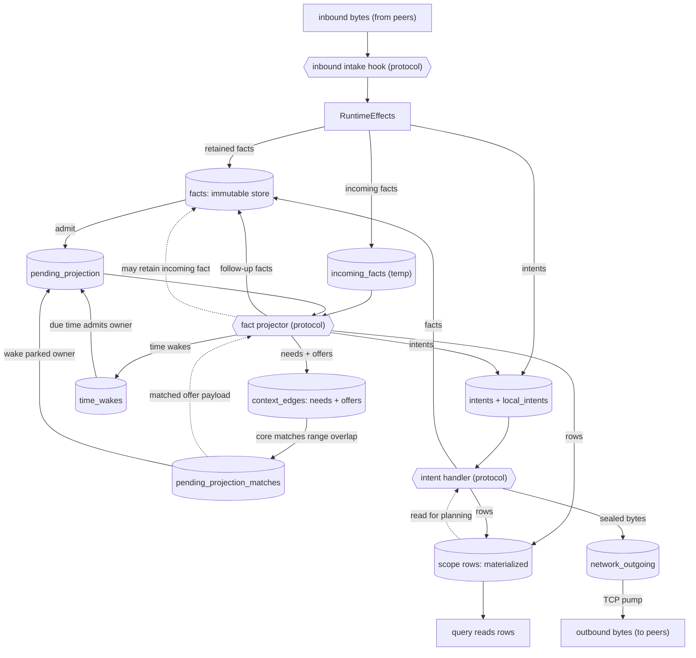
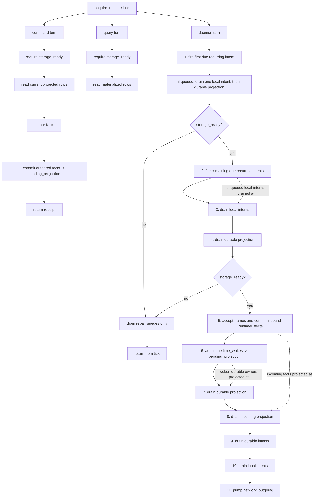
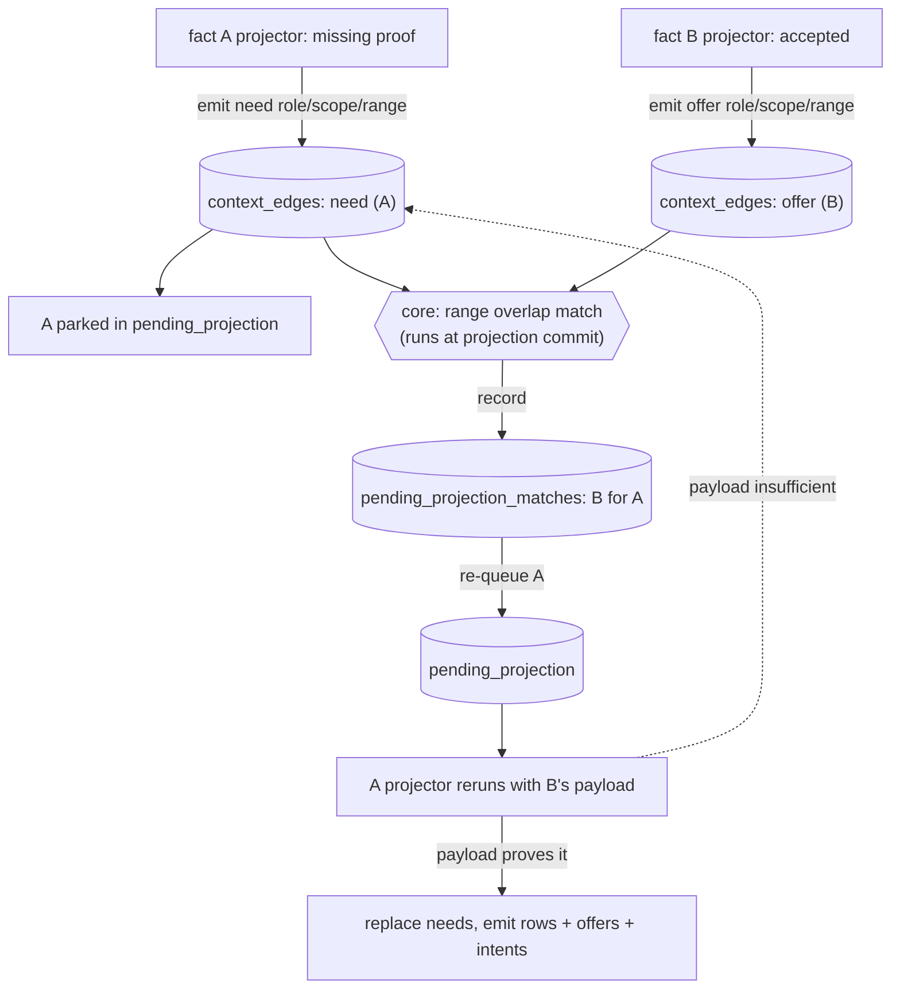

# Architecture Diagrams

GitHub-renderable Mermaid flowcharts for the Context runtime. They are a visual
companion to `README.md`, `src/core/README.md`, `docs/RULES.md`, and the scope
READMEs; the Rust modules remain the source of truth.

## The One Idea

The whole runtime is a small set of **queues** plus a little protocol-supplied
logic that core pumps between them. Two functions do the steady-state work of
the loop:

- a **fact projector** turns one fact into standing context, rows, time wakes,
  intents, and follow-up facts, and
- an **intent handler** performs one bounded stateful action (IO, sealing,
  responding) and returns more facts.

Protocol code also has thinner hooks at the edges — it authors facts for a
command, converts inbound network bytes into `RuntimeEffects`, and validates a
fact on admission — but those only feed the queues; the projector and handler
are where queued work is transformed.

Core never interprets a fact. It only admits facts, matches context ranges,
schedules wakes, and pumps these queues through the protocol functions. Most
queues are durable SQLite tables that survive restart; `incoming_facts` and
`local_intents` are `CREATE TEMP TABLE`, so they last as long as the SQLite
connection — the whole daemon session, or one CLI command — and a restart
rebuilds them empty. The daemon drains them each tick on its own long-lived
connection. A CLI command or query turn does not drain runtime queues. It reads
currently projected rows or commits authored facts to durable pending
projection. Because temp tables are connection-local and a CLI command runs on a
separate connection from the daemon, any temp rows such a turn stages are
dropped when its connection closes — they are not handed to the daemon (see
diagram 2):

```text
facts (+ local_fact_admissions)   immutable fact store
incoming_facts                    outside-origin facts staged for projection (temp)
pending_projection                facts waiting to be projected
context_edges                     standing needs and offers
pending_projection_matches        offers that matched a parked need
time_wakes                        facts scheduled to reproject at a time
intents (+ local_intents)         bounded work waiting for a handler (local is temp)
network_outgoing                  sealed bytes waiting for the TCP pump
<scope>_rows                      materialized state — read by queries and handlers, never by projectors
```

Each diagram below is one zoom level on that loop.

## 1) The Runtime Loop

A fact lands in `pending_projection` and the projector runs. Its output fans
into the other queues; core matches new offers against parked needs, re-queues
the woken owners, and dispatches intents to handlers, whose facts re-enter the
loop. Materialized rows are read-model and planning state, not part of the
projection→match cycle: projectors and context matching never read them.
Queries read rows, and handlers may read them when planning work (for example,
sync computing range summaries).



Core owns every arrow and the atomic commit behind it; the rounded boxes are the
only protocol code on the diagram. The inbound intake hook classifies opaque
network bytes into runtime effects but does not run projection. The projector is
pure derivation (it may park on missing context but never does IO); the handler
is the only place *protocol* code does bounded stateful work. Core still does
mechanical IO of its own — the TCP listener reads frames and the pump writes
`network_outgoing`, deferring targets whose sockets are not ready — but it moves
opaque bytes and never interprets a fact.

## 2) One Serialized Turn

Commands, queries, and the daemon turn all acquire `<db>.runtime.lock`, but they
do not all drive the runtime loop. A command verifies storage readiness, reads
currently projected state, authors facts, commits them to durable pending
projection, and returns a receipt. A query verifies storage readiness and reads
currently projected rows. The daemon turn (the recurring scheduler plus
`daemon::tick`) is the live loop that advances queues.



The difference between turns is whether they drain queues at all. Queries and
commands do not drain projection, incoming facts, time wakes, recurring work, or
handlers; they observe already projected state and may enqueue authored facts for
the daemon. Handler-emitted facts are committed atomically with intent dispatch
and remain queued for a later durable projection batch.

The recurring steps are daemon-only and are the source of all periodic work.
Recurring intents are not durable state: an in-memory `RecurringScheduler`,
installed once from the handler registry at daemon start, fires due operational
loops during `daemon::tick` and enqueues ordinary local intents. The first due
recurring loop gets a special readiness-repair chance before live IO; if storage
is not ready, the daemon drains only repair queues and skips normal network and
wall-clock work. The live daemon's cadence is only the scheduling mechanism; the
work itself is plain facts and handlers.

## 3) Needs And Offers

Context matching is the one mechanism that lets facts wake each other without
core understanding them. A projector that lacks proof emits a **need** and
parks; any fact may publish an **offer**. The match is not a background scan: it
runs inside the projection commit in `project_fact.rs`. When a projector's
output commits, core takes the needs and offers that output just added (the
context delta) and matches them against the already-stored set on `(role, scope,
range)` overlap — symmetrically, a newly committed offer wakes the owners of
overlapping stored needs, and a newly committed need is checked against stored
offers. Core records each hit in `pending_projection_matches` and re-queues the
matched owner with the offer payload attached; the woken projector then decides
whether that payload actually proves what it needed.



Three properties make this more than a dependency block: an offer may be
published before the need that consumes it exists; one offer can satisfy many
needs; and needs are a *replacement* subscription (a reprojection's needs fully
replace the prior set) while offers are append-only evidence until the owner
fact is purged. The concrete role/range catalog lives beside each scope's
projector docs, not here.

## 4) Sync: The Convergence Loop

The previous three diagrams are the loop running on one node. Sync is what makes
two nodes' loops converge, and it is best read as a back-and-forth over time
rather than a flowchart. The crucial point is that the network adds no new
machinery: every message on the wire is an ordinary fact, so each step is the
same `admit -> project (writes a row) -> emit intent -> handler emits the next
message` cycle from diagrams 1-3, just alternating between peers. The summaries
exchanged are negentropy range summaries (a `count` and a `fingerprint`) over
each peer's durable share/leaf/node index.


The same exchange runs in both directions over one connection, so each peer both
sends and receives. A productive response narrows the compared range, transfers
selected facts plus their closure, or just returns a same-range summary; for a
stable, authorized range whose transferred facts are admitted, these responses
drive the summaries together. But a round can make no progress — a same-range
summary with nothing to send, or a no-op because the peer already has the fact,
or it is missing, unshareable, or rejected on projection — so convergence is
eventual, not guaranteed per round.

Two divisions of labor keep this small. **Sync vs connection:** sync only
chooses fact ids and their dependency closure; connection decides how to batch,
seal, address, and write the bytes, and records a `connection_fact_receipt` so
live-tail can skip the origin peer. **Core vs protocol:** core pumps opaque
length-prefixed bytes and never parses a frame — the recurring drivers
(`maintain_connections`, `maintain_sync`) are just handlers emitting ordinary
facts. The handshake that brings a connection live (request, connection,
ephemeral-secret context), the established frame types (`frame_small`,
`frame_file_slice`, `frame_bundle`), and the exact compare/have/need fact
layouts are detailed in `src/protocol/connection/README.md` and
`src/protocol/sync/README.md`.
