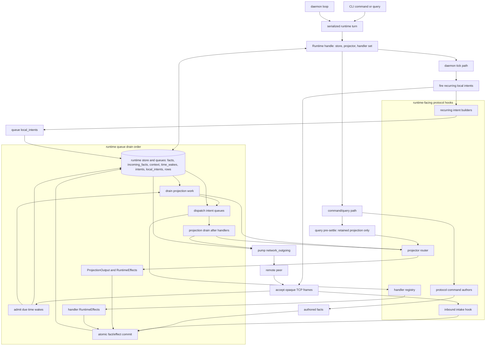
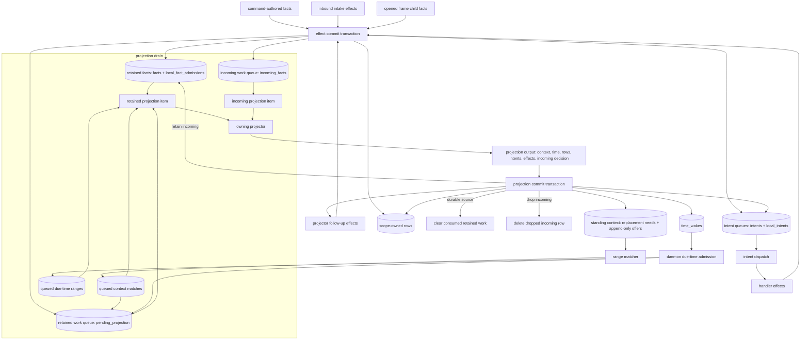
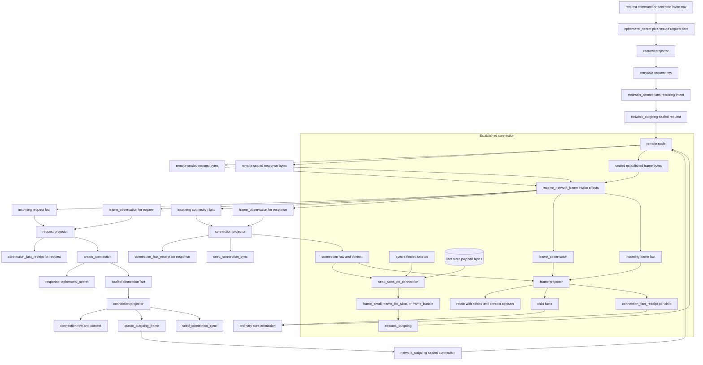
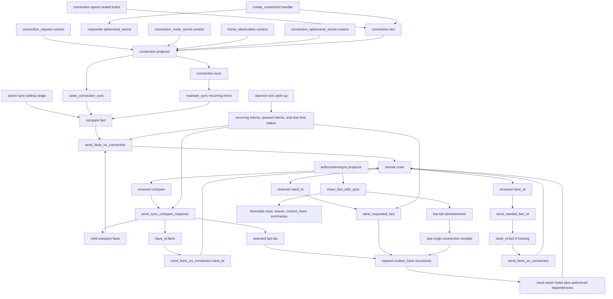
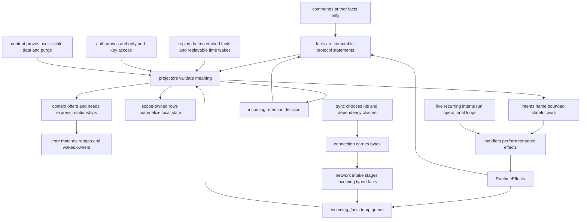

# Architecture Diagrams

These are GitHub-renderable Mermaid flowcharts for the current Context
architecture. They are a visual companion to `README.md`, `docs/RULES.md`, and
the scope READMEs; the Rust modules remain the source of truth.

## 0) Runtime Boundaries

Context has one protocol-neutral runtime organized around serialized turns.
Core owns turn locking, queue draining, context matching, transaction
boundaries, time-wake admission, recurring schedule firing, and opaque network
bytes. Protocol code participates through runtime-facing hooks: command authors,
inbound intake, the projector router, the handler registry, and recurring intent
builders.

## 1) Fact Admission And Context Matching

Facts enter through the shared effect commit path, then projection drains the
queues that commit created. Command output is normalized to
`RuntimeEffects::facts`; handlers, inbound intake, and projector follow-up work
already return `RuntimeEffects`. `commit_runtime_effects_in_tx` retains
`RuntimeEffects::facts` and queues retained projection work, but only stages
`RuntimeEffects::incoming_facts` in the temporary incoming queue. `drain_projection`
selects retained work first, then ready incoming work. The owning projector is
the decision point: `commit_projection_effects_in_tx` either clears retained
work, retains an incoming fact, or deletes the incoming row, then writes the
projector's declared context, time wakes, rows, intents, and follow-up effects.
In code, durable effect facts use `insert_fact_and_pending_with_mode_in_tx`,
incoming effect facts use `insert_incoming_fact_in_tx`, retained projection uses
`pending_durable_projection_items`, incoming projection uses
`incoming_pending_fact_ids`, and the incoming decision commits through
`move_incoming_to_retained_in_tx` or `delete_incoming_fact_in_tx`.
Context is a range relationship: an offer can satisfy many needs, and an offer
may exist before a later fact creates the matching need.

The lifecycle diagram above is the context diagram: it shows projectors
declaring needs and offers, core matching ranges, and matches waking later
projection work. The concrete role catalog belongs beside the projector docs
that own those roles, not in a second architecture graph.

## 2) Connection Bootstrap And Established Frames

Connection owns sealed transport. Request and connection facts are their own
sealed wire bytes. The daemon converts accepted TCP bytes through
`receive_network_frame` intake effects, which stage typed incoming facts plus
`frame_observation`. Request sends are live operational work from
`maintain_connections`; response sends are emitted by the connection projector
after the connection fact commits. Established frames carry ordinary fact bytes;
once opened, child facts return to core admission and their owning scope
validates meaning.

## 3) Sync Seed, Live Tail, And Catch-Up

Sync plans replication over connection rows. A connection becomes live only
after its projector validates request, authority, observation, and
ephemeral-secret context. That projection writes the live connection row and
emits `seed_connection_sync`. The seed and live-only recurring `maintain_sync`
path create compares over the active local sync-setting range. Later share
contributions live-tail to established authorized connections. Periodic daemon
ticks drain recurring intents, queued compare, have, need, fact-send, and
replayable time-wake work when catch-up remains.

## 4) Responsibility Summary

