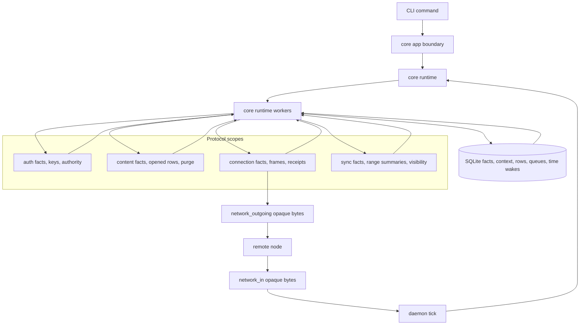
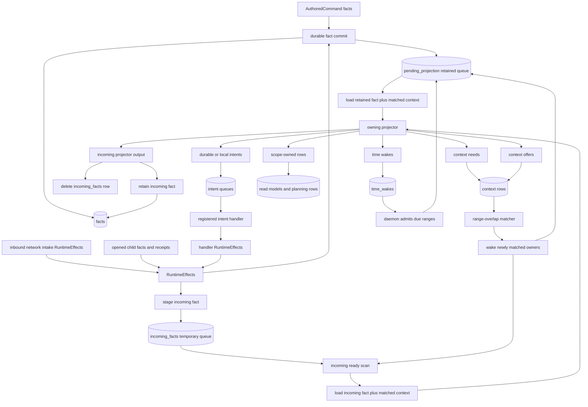
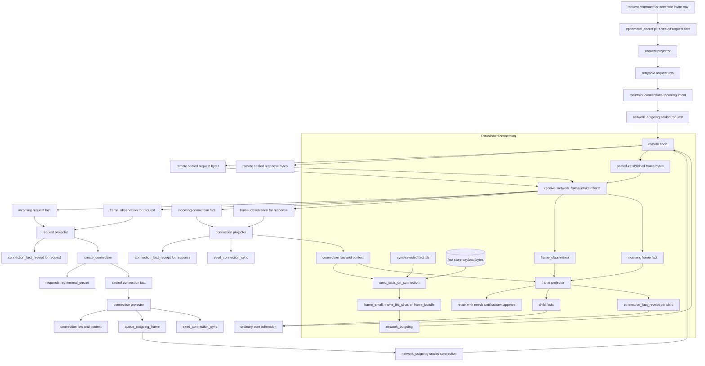
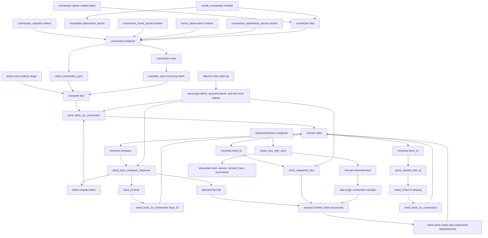
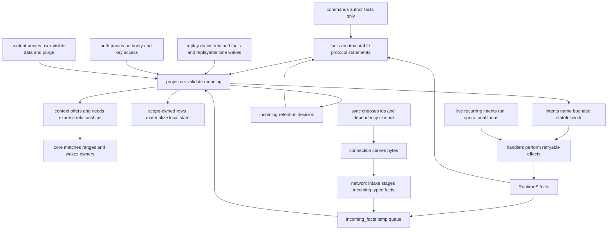

# Architecture Diagrams

These are GitHub-renderable Mermaid flowcharts for the current Context
architecture. They are a visual companion to `README.md`, `docs/RULES.md`, and
the scope READMEs; the Rust modules remain the source of truth.

## 0) Runtime Boundaries

Context has one protocol-neutral runtime and several protocol scopes. Core owns
fact admission, context matching, queue mechanics, transaction boundaries, and
opaque network bytes. Protocol scopes own fact meaning, projection, row
materialization, and bounded intent handlers.

## 1) Fact Admission And Context Matching

Facts enter from commands, inbound network intake, opened frames, and handlers.
Core commits command-authored facts and `RuntimeEffects::facts` as retained
`facts` with `pending_projection` rows. Core stages
`RuntimeEffects::incoming_facts` in the temporary `incoming_facts` queue; the
runtime drains those rows straight into the owning projector, and projector
output decides whether core retains the incoming fact or deletes it. Projection
emits the complete standing needs and offers for the fact being projected.
Context is a range relationship: an offer can satisfy many needs, and an offer
may exist before a later fact creates the matching need.

The lifecycle diagram above is the context diagram: it shows projectors
declaring needs and offers, core matching ranges, and matches waking later
projection work. The concrete role catalog belongs beside the projector docs
that own those roles, not in a second architecture graph.

## 2) Connection Bootstrap And Established Frames

Connection owns sealed transport. Request and connection facts are their own
sealed wire bytes. The daemon converts accepted TCP bytes through
`receive_network_frame` intake effects, which stage typed incoming facts plus
`frame_observation`. Request sends are live operational work from
`maintain_connections`; response sends are emitted by the connection projector
after the connection fact commits. Established frames carry ordinary fact bytes;
once opened, child facts return to core admission and their owning scope
validates meaning.

## 3) Sync Seed, Live Tail, And Catch-Up

Sync plans replication over connection rows. A connection becomes live only
after its projector validates request, authority, observation, and
ephemeral-secret context. That projection writes the live connection row and
emits `seed_connection_sync`. The seed and live-only recurring `maintain_sync`
path create compares over the active local sync-setting range. Later share
contributions live-tail to established authorized connections. Periodic daemon
ticks drain recurring intents, queued compare, have, need, fact-send, and
replayable time-wake work when catch-up remains.

## 4) Responsibility Summary

