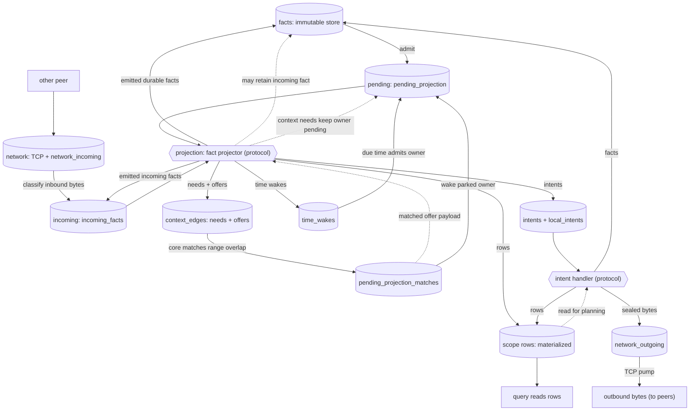
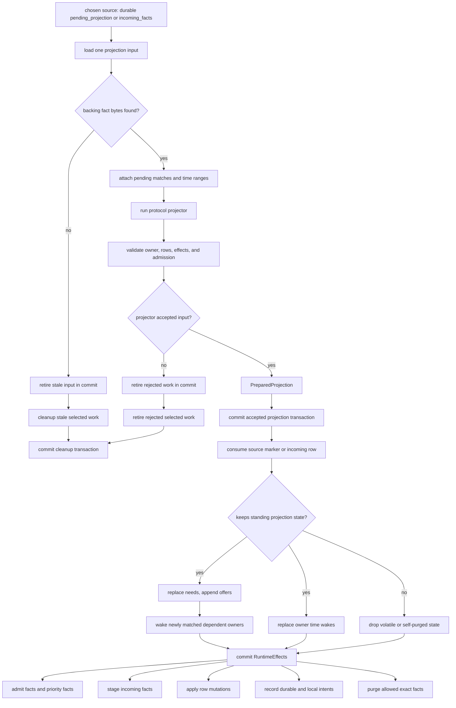
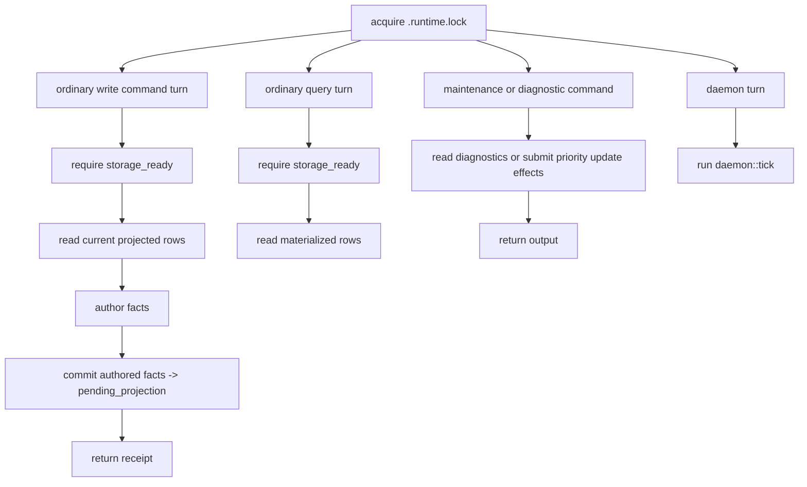
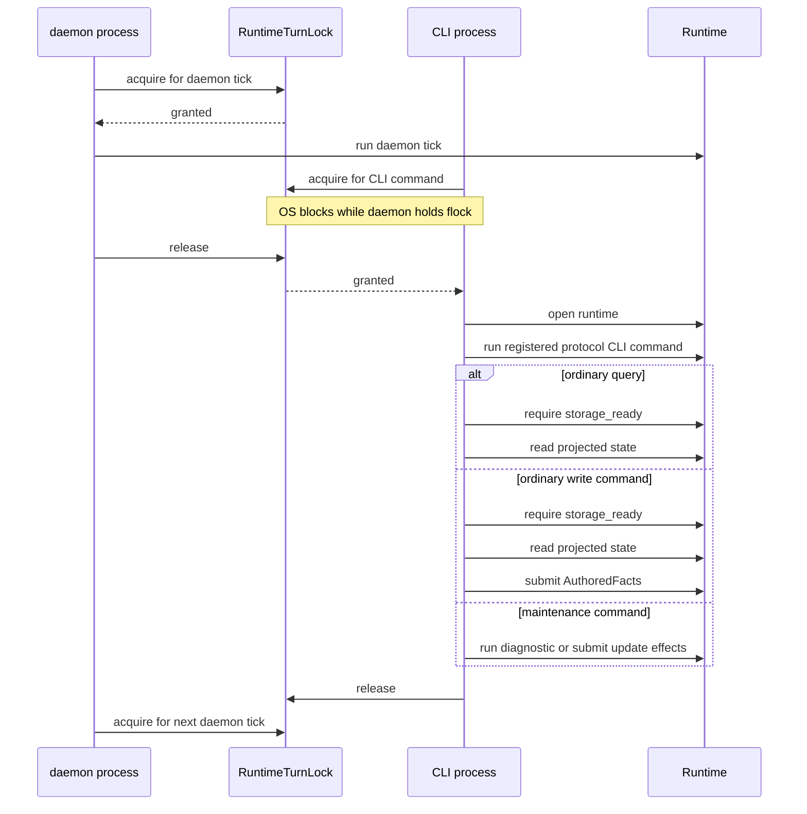
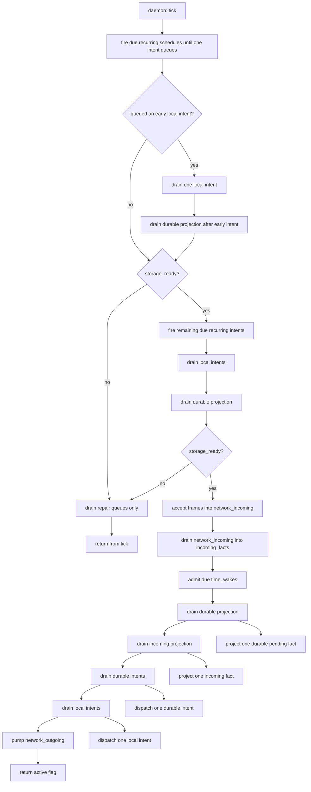
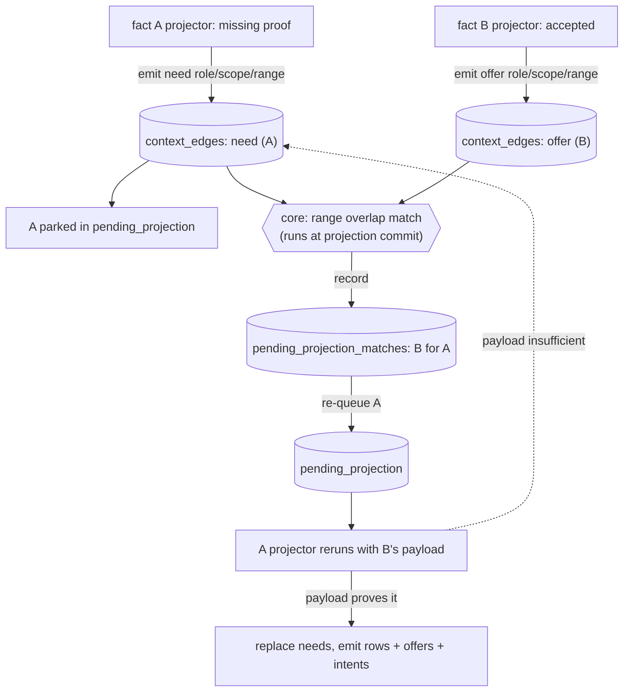
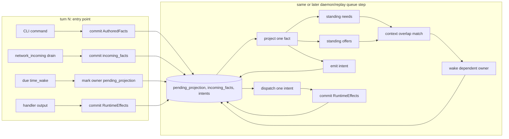
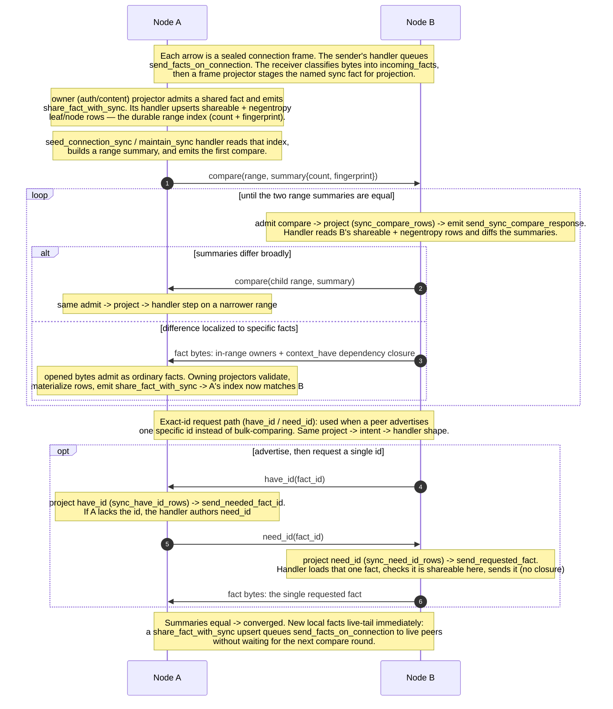

# Architecture Diagrams

GitHub-renderable Mermaid flowcharts for the Context runtime. They are a visual
companion to `README.md`, `src/core/README.md`, `docs/RULES.md`, and the scope
READMEs; the Rust modules remain the source of truth.

## Runtime Queue Model

The runtime is a queue-driven system. Core owns queue storage, scheduling, and
commit boundaries. Protocol code supplies the two callbacks that transform
queued work:

- a **fact projector** turns one fact into standing context, rows, time wakes,
  intents, durable facts, and incoming facts, and
- an **intent handler** performs one bounded stateful action (IO, sealing,
  responding) and returns a `RuntimeEffects` batch.

Protocol code also supplies edge hooks: command authoring, inbound byte
classification, and fact admission validation. Those hooks feed queues; they do
not drain queues or decide runtime ordering.

Core never interprets a fact. It only admits facts, matches context ranges,
schedules wakes, and pumps these queues through the protocol functions. Most
queues are durable SQLite tables that survive restart; `incoming_facts` and
`local_intents` are `CREATE TEMP TABLE`, so they last as long as the SQLite
connection - the whole daemon session, or one CLI command - and a restart
recreates them empty. The daemon drains them each tick on its own long-lived
connection. A normal CLI command or query turn does not drain runtime queues. It
reads currently projected rows or commits authored facts to durable pending
projection. Because temp tables are connection-local and a CLI command runs on a
separate connection from the daemon, temp rows from one turn are not handed to
another turn (see diagram 3):

```text
facts (+ local_fact_admissions)   immutable fact store
network_incoming                  raw inbound frame bytes awaiting classification (temp)
incoming_facts                    incoming facts staged for projection (temp)
pending_projection                pending facts waiting to be projected
context_edges                     standing needs and offers
pending_projection_matches        offers that matched a parked need
time_wakes                        facts scheduled to reproject at a time
intents (+ local_intents)         bounded work waiting for a handler (local is temp)
network_outgoing                  sealed bytes waiting for the TCP pump
<scope>_rows                      materialized state, read by queries and handlers, never by projectors
```

The sections below isolate the main queue transitions and runtime boundaries.

## 1) The Runtime Loop

A durable fact reaches projection through `pending_projection`. A network fact
reaches projection through `incoming_facts`. Projector output can add context,
rows, time wakes, intents, emitted durable facts, emitted incoming facts, or a
decision to retain the incoming input. Core matches new offers against parked
needs, re-queues woken owners, and dispatches intents to handlers; handler
output re-enters the same queues.

Materialized rows are read-model and planning state, not part of the projection
and context-match cycle. Projectors and context matching never read them.
Queries read rows, and handlers may read rows when planning bounded work, such
as sync range summaries.



Core owns every queue transition and the atomic commit behind it; the rounded
boxes are the protocol callbacks. The inbound classifier turns network bytes
into typed incoming facts, but it does not run projection or decide durability.
Projectors are deterministic derivation: they may park on missing context, but
they do not perform IO. Intent handlers are the protocol-owned boundary for
bounded stateful work. Core still performs mechanical IO of its own: the TCP
listener reads frames, the raw incoming queue holds them until classification,
and the pump writes `network_outgoing`, deferring targets whose sockets are not
ready. That IO moves length-prefixed bytes and never interprets facts.

## 2) Project One Fact

Projection is a single-item queue drain. `Runtime::drain_durable_projection` and
`Runtime::drain_incoming_projection` call `project_one` repeatedly. Each call
handles one durable pending owner or one volatile incoming fact. Everything
before the commit is calculation. The commit consumes the selected work and
publishes replacement context, time wakes, rows, facts, and intents as one SQL
boundary.



Durable projection drains from `pending_projection`; incoming projection drains
from process-local `incoming_facts`. Incoming rows project once. The projector
may retain the incoming fact as durable evidence, retain it while parked on
context, or drop it after opening it into incoming child facts. Emitted facts
are not projected inline: durable emitted facts go to `facts` and
`pending_projection`, incoming emitted facts go to `incoming_facts`, and a later
projection item handles each one.

## 3) Serialized Turns And Locks

Commands, queries, and the daemon turn all acquire `<db>.runtime.lock`, but they
do not all drive the runtime loop. A normal write command verifies storage
readiness, reads currently projected state, authors facts, commits them to
durable pending projection, and returns a receipt. A normal query verifies
storage readiness and reads currently projected rows. Maintenance commands such
as protocol update and replay diagnostics may bypass readiness, but they still
do not run daemon queue drains. The daemon turn (the recurring scheduler plus
`daemon::tick`) is the live loop that advances queues.



The difference between turns is whether they drain queues at all. Queries and
commands do not drain projection, incoming facts, time wakes, recurring work, or
handlers; they observe already projected state and may enqueue authored facts for
the daemon. Handler-emitted facts are committed atomically with intent dispatch
and remain queued for a later durable projection batch.



The lock is an OS `flock`. A CLI process that arrives while the daemon is in a
turn waits in the kernel until the daemon releases the file lock. There is no
shared in-process command slot inside the daemon tick.

## 4) Daemon Tick Queue Order

Inside one daemon tick, recurring schedules get a pre-readiness pass that stops
after the first queued local intent. Protocols can put a readiness repair route
first, giving that work a chance to run before live IO. If storage is ready, the
daemon runs the live queues in an explicit order. The full `project one fact`
path above is represented here as a single node.



The recurring steps are daemon-only and are the source of all periodic work.
Recurring intents are not durable state: an in-memory `RecurringScheduler`,
installed once from the handler registry at daemon start, fires due operational
loops during `daemon::tick` and enqueues ordinary local intents. The pre-readiness
recurring pass gives the first queued local intent a special repair chance before
live IO; if storage is not ready, the daemon drains only repair queues and skips
normal network and wall-clock work. The live daemon's cadence is only the
scheduling mechanism; the work itself is plain facts and handlers.

## 5) Needs And Offers

Context matching is the one mechanism that lets facts wake each other without
core understanding them. A projector that lacks proof emits a **need** and
parks; any fact may publish an **offer**. The match is not a background scan: it
runs inside the projection commit in `project_fact.rs`. When a projector's
output commits, core takes the needs and offers that output just added (the
context delta) and matches them against the already-stored set on `(role, scope,
range)` overlap — symmetrically, a newly committed offer wakes the owners of
overlapping stored needs, and a newly committed need is checked against stored
offers. Core records each hit in `pending_projection_matches` and re-queues the
matched owner with the offer payload attached; the woken projector then decides
whether that payload actually proves what it needed.



Three properties make this more than a dependency block: an offer may be
published before the need that consumes it exists; one offer can satisfy many
needs; and needs are a *replacement* subscription (a reprojection's needs fully
replace the prior set) while offers are append-only evidence until the owner
fact is purged. The concrete role/range catalog lives beside each scope's
projector docs, not here.

## 6) Queued Cause Chain

A runtime turn is one exclusive period under `RuntimeTurnLock`, but a causal
chain can span many turns. Entry points first commit queued work. Later daemon
or replay drains project one fact or dispatch one intent. Projection and
handlers can both emit more queued work, so the same chain moves forward without
nesting projection or handlers inline.



The contract is that queue commits, not call-stack nesting, carry the chain
forward. A handler that emits facts does not project them before returning; a
projector that emits intents does not run their handlers before committing.

## 7) Daemon Network Flow

The daemon owns background network progress. Incoming bytes are accepted by core
into `network_incoming`, then drained through the protocol inbound classifier
into `incoming_facts`. Projection opens those incoming facts with standing
context plus incoming metadata. Projectors emit durable observation or receipt
facts when receive metadata must survive replay, and established frame
projectors stage contained facts back into incoming projection. Outgoing bytes
are produced by protocol handlers and written by the core TCP pump.

```mermaid
%%{init: {"flowchart": {"wrappingWidth": 300}} }%%
flowchart LR
    PEER["another peer"] --> TCP_IN["TCP listener"]

    subgraph DAEMON["local daemon tick"]
        TCP_IN --> ACCEPT["accept_available"]
        ACCEPT --> RAW_IN["network_incoming raw bytes + origin metadata"]
        RAW_IN --> INTAKE["receive_network_frame_facts"]
        INTAKE --> FRAME_FACT["incoming request, connection, or frame fact"]
        RAW_IN -.origin and receive-time metadata.-> PROJECT_FRAME["drain incoming projection: project frame fact"]
        FRAME_FACT --> PROJECT_FRAME
        PROJECT_FRAME --> CHILD_FACTS["opened child facts"]
        CHILD_FACTS --> CHILD_INCOMING[("incoming_facts")]
        PROJECT_FRAME --> RECEIVE_FACTS["receipt or observation facts"]
        RECEIVE_FACTS --> RETAINED_FACTS[("facts -> pending_projection")]
        CHILD_INCOMING --> LATER_PROJECT["later projection"]
        RETAINED_FACTS --> LATER_PROJECT

        LATER_PROJECT --> FOLLOWUP_INTENTS["sync or connection follow-up intents"]
        FOLLOWUP_INTENTS --> SEND_FACTS["send_facts_on_connection handler"]
        FOLLOWUP_INTENTS --> QUEUE_FRAME["queue_outgoing_frame handler"]
        SEND_FACTS --> OUTBOUND_ROWS["network_outgoing rows"]
        QUEUE_FRAME --> OUTBOUND_ROWS
        OUTBOUND_ROWS --> TCP_OUT["TCP pump"]
    end

    TCP_OUT --> PEER
```



`receive_network_frame_facts` does not unseal established frames or run a
handler. It chooses the incoming fact family from frame bytes and lets that
fact's projector decide whether to retain or drop the fact. Origin and
receive-time metadata stay on the incoming queue/context path; projectors use
that metadata only when emitting durable observation or receipt facts.

## 8) Sync: The Convergence Loop

The previous sections describe one node's loop. Sync is the same loop
alternating between peers over time. The network adds no separate runtime
machinery: every message on the wire is an ordinary fact, so each step is the
same `admit -> project (writes a row) -> emit intent -> handler emits the next
message` cycle. The summaries exchanged are negentropy range summaries (a
`count` and a `fingerprint`) over each peer's durable share/leaf/node index.



The same exchange runs in both directions over one connection, so each peer both
sends and receives. A productive response narrows the compared range, transfers
selected facts plus their closure, or just returns a same-range summary; for a
stable, authorized range whose transferred facts are admitted, these responses
drive the summaries together. But a round can make no progress — a same-range
summary with nothing to send, or a no-op because the peer already has the fact,
or it is missing, unshareable, or rejected on projection — so convergence is
eventual, not guaranteed per round.

Two boundaries define the exchange. **Sync vs connection:** sync chooses fact
ids and their dependency closure; connection decides how to batch, seal,
address, and write the bytes, and records a `connection_fact_receipt` so
live-tail can skip the origin peer. **Core vs protocol:** core pumps
length-prefixed bytes and never parses a frame; recurring drivers
(`maintain_connections`, `maintain_sync`) are handlers emitting ordinary facts.
The handshake that brings a connection live (request, connection,
ephemeral-secret context), the established frame types (`frame_small`,
`frame_file_slice`, `frame_bundle`), and the exact compare/have/need fact
layouts are detailed in `src/protocol/connection/README.md` and
`src/protocol/sync/README.md`.
