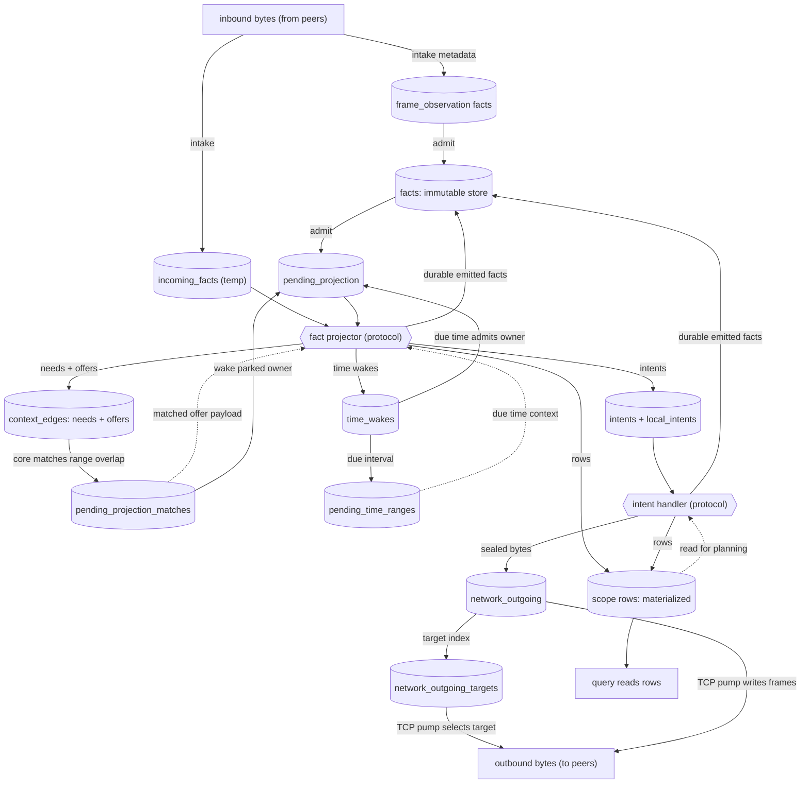
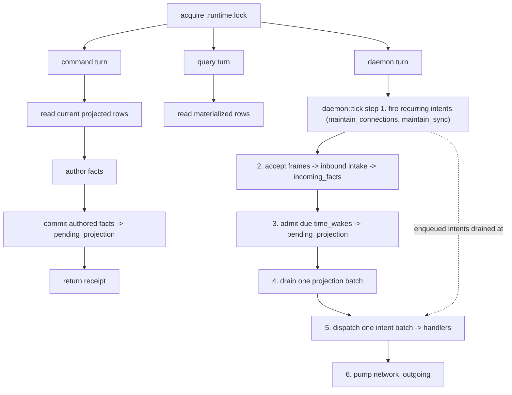
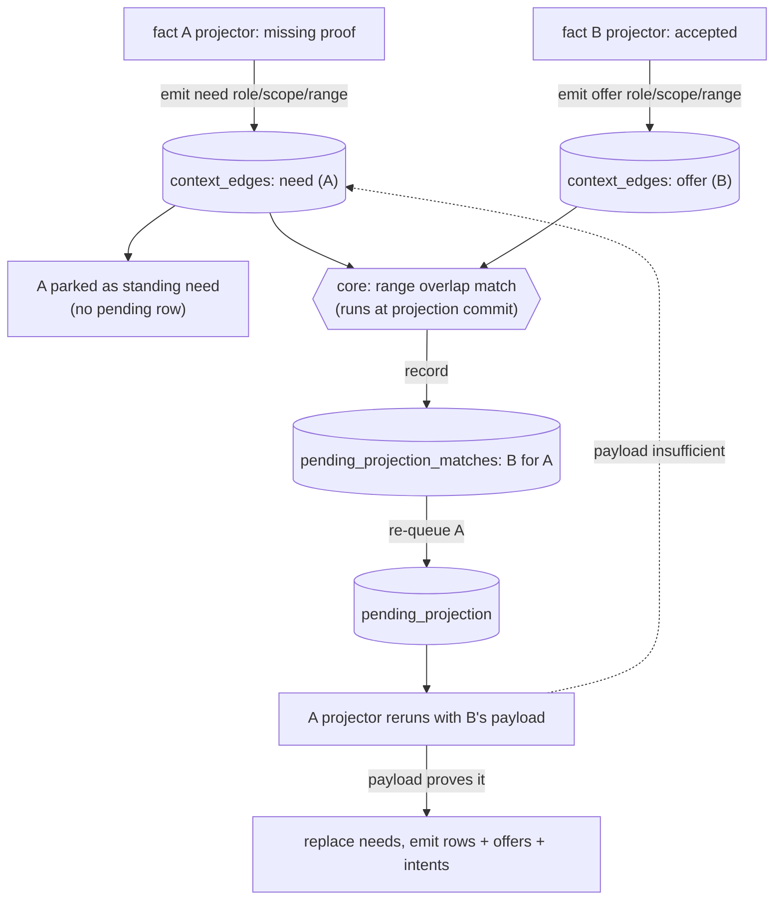

# Architecture Diagrams

GitHub-renderable Mermaid flowcharts for the Context runtime. They are a visual
companion to `README.md`, `src/core/README.md`, `docs/RULES.md`, and the scope
READMEs; the Rust modules remain the source of truth.

## The One Idea

The whole runtime is a small set of **queues** plus a little protocol-supplied
logic that core pumps between them. Two functions do the steady-state work of
the loop:

- a **fact projector** turns one fact into standing context, rows, time wakes,
  intents, and follow-up facts, and
- an **intent handler** performs one bounded retryable action (IO, sealing,
  responding) and returns more facts.

Protocol code also has thinner hooks at the edges — it authors facts for a
command, converts inbound network bytes into incoming facts, and validates a
fact on admission — but those only feed the queues; the projector and handler
are where queued work is transformed.

Core never interprets a fact. It only admits facts, matches context ranges,
schedules wakes, and pumps these queues through the protocol functions. Most
queues are durable SQLite tables that survive restart; `incoming_facts` and
`local_intents` are `CREATE TEMP TABLE`, so they last as long as the SQLite
connection — the whole daemon session, or one CLI command — and a restart
rebuilds them empty. The daemon drains them each tick on its own long-lived
connection. A CLI command or query turn does not drain runtime queues. It reads
currently projected rows or commits authored facts to durable pending
projection. Because temp tables are connection-local and a CLI command runs on a
separate connection from the daemon, any temp rows such a turn stages are
dropped when its connection closes — they are not handed to the daemon (see
diagram 2):

```text
facts (+ local_fact_admissions)   immutable fact store
incoming_facts                    outside-origin facts staged for projection (temp)
pending_projection                scheduled projection attempts for retained facts
pending_time_ranges               due time context attached to pending owners
context_edges                     standing needs and offers
pending_projection_matches        offers that matched a parked need
time_wakes                        facts scheduled to reproject at a time
intents (+ local_intents)         bounded work waiting for a handler (local is temp)
network_outgoing                  sealed bytes waiting for the TCP pump
network_outgoing_targets          active target index for the TCP pump
<scope>_rows                      materialized state — read by queries and handlers, never by projectors
```

`pending_time_ranges` is not an independent queue. `pending_projection` is keyed
only by owner, so several causes can coalesce into one pending owner row.
`pending_time_ranges` carries the due timeline interval that woke that owner.
Keeping that cause separate lets a projector see *which declared wake fired*
without making every projector depend on ambient wall-clock time. A global
`time_now` context would make projection order and replay depend on the current
clock, require broad re-queues just because time moved, and hide the fact-owned
subscription that asked to be woken. A time wake is instead a standing
fact-owned request; daemon time merely turns due requests into explicit
projection context.

Purges are also not a queue. A projector or handler may return an exact purged
fact id in `RuntimeEffects`; core removes that fact and core-owned derived rows
inside the same commit that applies rows, facts, and intents.

Each diagram below is one zoom level on that loop.

## 1) The Runtime Loop

A fact lands in `pending_projection` and the projector runs. Its output fans
into the other queues; core matches new offers against parked needs, re-queues
the woken owners, and dispatches intents to handlers, whose durable emitted
facts re-enter the loop through `facts` plus `pending_projection` in the same
transaction. Emitting a need does not keep an owner in `pending_projection`;
after that projection attempt commits, the standing need parks the owner until
matching context re-queues it. `incoming_facts` is only the temp outside-origin
staging path. Materialized rows are read-model and planning state, not part of
the projection->match cycle: projectors and context matching never read them.
Queries read rows, and handlers may read them when planning work (for example,
sync computing range summaries).



Core owns every arrow and the atomic commit behind it; the two rounded boxes are
the only protocol code on the diagram. The projector is pure derivation (it may
park on missing context but never does IO); the handler is the only place
*protocol* code does bounded, retryable work. Core still does mechanical IO of
its own — the TCP listener reads frames and the pump writes `network_outgoing`,
deferring targets whose sockets are not ready — but it moves opaque bytes and
never interprets a fact.

## 2) One Serialized Turn

Commands, queries, and the daemon turn all acquire `<db>.runtime.lock`, but they
do not all drive the runtime loop. A command reads currently projected state,
authors facts, commits them to durable pending projection, and returns a
receipt. A query reads currently projected rows. The daemon turn (the recurring
scheduler plus `daemon::tick`) is the live loop that advances queues.



The difference between turns is which queues they drain. Ordinary queries only
read already projected rows. Ordinary commands read currently projected rows,
commit authored facts to durable pending projection, and return; they do not
privately project their writes or dispatch handlers. Incoming facts, due time,
recurring work, and handler-derived state are daemon progress, observed
eventually, not produced inside a user command. Handler-emitted facts are
committed atomically with intent dispatch and remain queued for a later
projection batch.

The recurring step is daemon-only and is the source of all periodic work.
Recurring intents are not durable state: an in-memory `RecurringScheduler`,
installed once from the handler registry at daemon start, fires due operational
loops at the top of `daemon::tick` and enqueues ordinary intents that the same
tick's intent batch dispatches like any other. The live daemon's cadence is only
the scheduling mechanism; the work itself is plain facts and handlers.

## 3) Needs And Offers

Context matching is the one mechanism that lets facts wake each other without
core understanding them. A projector that lacks proof emits a **need** and
parks as standing context; the pending work row for that projection attempt is
cleared. Any fact may publish an **offer**. The match is not a background scan:
it runs inside the projection commit in `project_fact.rs`. When a projector's
output commits, core takes the needs and offers that output just added (the
context delta) and matches them against the already-stored set on `(role, scope,
range)` overlap — symmetrically, a newly committed offer wakes the owners of
overlapping stored needs, and a newly committed need is checked against stored
offers. Core records each hit in `pending_projection_matches` and re-queues the
matched owner with the offer payload attached; the woken projector then decides
whether that payload actually proves what it needed.



Three properties make this more than a dependency block: an offer may be
published before the need that consumes it exists; one offer can satisfy many
needs; and needs are a *replacement* subscription (a reprojection's needs fully
replace the prior set) while offers are append-only evidence until the owner
fact is purged. The concrete role/range catalog lives beside each scope's
projector docs, not here.

## 4) Connection Bootstrap

Connection bootstrap is the live-session setup path. The wire exchange is just
two sealed facts plus local observation metadata. Intake creates the observation
fact; the request and connection projectors later consume that observation as
context and emit `connection_fact_receipt` facts after they have opened and
checked the path.

```mermaid
sequenceDiagram
    autonumber
    participant A as Initiator
    participant B as Responder

    Note over A: A command or maintain_connections creates local ephemeral material,<br/>a sealed request fact, and request retry rows. maintain_connections queues<br/>the sealed request bytes directly into network_outgoing.
    A->>B: sealed request bytes

    Note over B: daemon intake classifies the bytes and commits RuntimeEffects:<br/>incoming request fact + local frame_observation fact.
    Note over B: request projector opens the request using local endpoint,<br/>invite or membership context, and frame_observation context.<br/>It emits connection_fact_receipt and create_connection.
    Note over B: create_connection handler creates responder ephemeral_secret<br/>and sealed connection facts.
    Note over B: connection projector writes connection_rows, offers connection<br/>and connection_for_request, emits seed_connection_sync, and emits local<br/>queue_outgoing_frame for the sealed response bytes.

    B->>A: sealed connection bytes

    Note over A: daemon intake commits incoming connection fact + frame_observation fact.
    Note over A: initiator connection projector consumes original request,<br/>initiator ephemeral secret, local endpoint/invite or membership context,<br/>and frame_observation. It writes connection_rows, emits connection_fact_receipt,<br/>and emits seed_connection_sync.

    Note over A,B: After both sides have connection_rows, sync seed or recurring<br/>maintain_sync creates compare facts. Later payload sends use<br/>send_facts_on_connection; projection-created response bytes use queue_outgoing_frame.<br/>Both paths add opaque bytes to network_outgoing for the core TCP pump.
```

`receive_network_frame` is not a queued intent in the current runtime, and
there is no `send_network_frame` handler. Inbound bytes are delivered directly
to the daemon intake hook. Outbound protocol handlers that already know the
route add opaque frame rows to `network_outgoing`; `queue_outgoing_frame` is the
local-intent bridge for projection-created bytes that still need route lookup.

## 5) Sync: The Convergence Loop

The runtime diagrams above describe how one node drains work; the bootstrap
diagram shows how two nodes establish a live session. Sync is what makes two
nodes' loops converge, and it is best read as a back-and-forth over time rather
than a flowchart. The crucial point is that the network adds no new machinery:
every message on the wire is an ordinary fact, so each step is the same `admit
-> project (writes a row) -> emit intent -> handler emits the next message`
cycle from diagrams 1-3, just alternating between peers. The summaries
exchanged are negentropy range summaries (a `count` and a `fingerprint`) over
each peer's durable share/leaf/node index.


The same exchange runs in both directions over one connection, so each peer both
sends and receives. A productive response narrows the compared range, transfers
selected facts plus their closure, or just returns a same-range summary; for a
stable, authorized range whose transferred facts are admitted, these responses
drive the summaries together. But a round can make no progress — a same-range
summary with nothing to send, or a no-op because the peer already has the fact,
or it is missing, unshareable, or rejected on projection — so convergence is
eventual, not guaranteed per round.

Two divisions of labor keep this small. **Sync vs connection:** sync only
chooses fact ids and their dependency closure; connection decides how to batch,
seal, address, and write the bytes, and records a `connection_fact_receipt` so
live-tail can skip the origin peer. **Core vs protocol:** core pumps opaque
length-prefixed bytes and never parses a frame — the recurring drivers
(`maintain_connections`, `maintain_sync`) are just handlers emitting ordinary
facts. The handshake that brings a connection live (request, connection,
ephemeral-secret context), the established frame types (`frame_small`,
`frame_file_slice`, `frame_bundle`), and the exact compare/have/need fact
layouts are detailed in `src/protocol/connection/README.md` and
`src/protocol/sync/README.md`.
