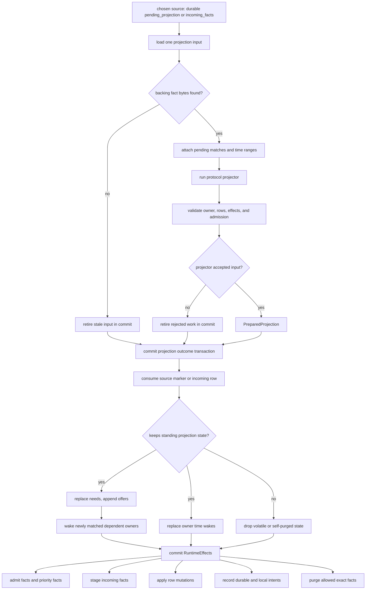
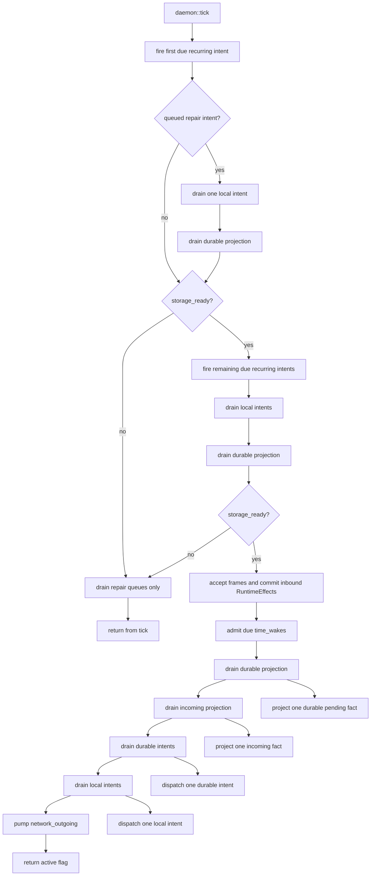
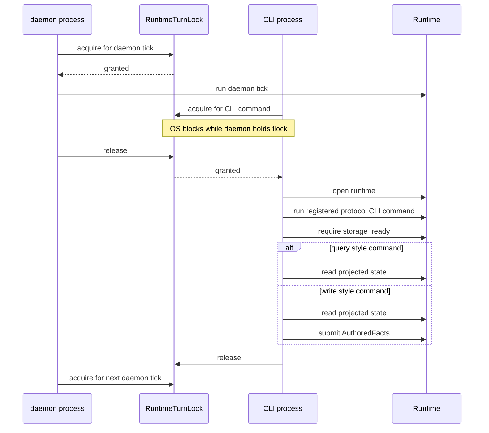

# Architecture Diagrams Alt

These diagrams describe the current poc-10 runtime shape in code terms. The
important distinction is that a daemon tick and a CLI invocation are separate
runtime turns. They do not call each other. They serialize through the same
`RuntimeTurnLock` for one database.

## Project One Fact

`Runtime::drain_durable_projection` and `Runtime::drain_incoming_projection`
call `project_one` repeatedly. Each call handles one durable pending owner or
one volatile incoming fact. Everything before the commit is calculation. The
commit consumes the selected work and publishes replacement context, time wakes,
rows, facts, and intents as one SQL boundary.

## Daemon Queue Steps

Inside one daemon tick, the first due recurring loop gets a chance to repair
storage before live IO. If storage is ready, the daemon runs the live queues in
an explicit order. The full `project one fact` path above is represented here as
a single node.

## Turns, Matches, And Intents

A runtime turn is one exclusive period under `RuntimeTurnLock`. Work can remain
queued between turns. Projection creates standing context. Newly added offers
wake matching needs. Projection and handlers both emit intents, and handlers can
emit more facts, so later turns may keep moving the same causal chain forward.

## CLI Commands Are Separate Turns

CLI queries and CLI commands use a separate entry point from the daemon loop.
They wait for the same runtime turn lock. Once they hold the lock, they open the
runtime directly and run a registered protocol CLI command. Queries and
commands require `storage_ready`, then read currently projected rows. Write
commands commit authored facts to durable pending projection and return; they do
not drain projection, incoming facts, time wakes, recurring work, or handlers.

## Daemon Network Flow

The daemon owns background network progress. Another peer is abstracted here as
one node. Incoming network bytes are accepted by core and passed to the protocol
inbound intake hook. The hook commits `RuntimeEffects`: a retained receive
observation fact plus a temporary incoming frame fact for recognized frames.
Projection opens that incoming fact with standing context and emits recovered
protocol facts. Outgoing bytes are produced by protocol handlers and written by
the core TCP pump.

```mermaid
%%{init: {"flowchart": {"wrappingWidth": 300}} }%%
flowchart LR
    PEER["another peer"] --> TCP_IN["TCP listener"]

    subgraph DAEMON["local daemon tick"]
        TCP_IN --> ACCEPT["accept_available"]
        ACCEPT --> INTAKE["receive_network_frame_effects"]
        INTAKE --> OBSERVATION["retained frame_observation fact"]
        INTAKE --> FRAME_FACT["incoming request, connection, or frame fact"]
        OBSERVATION -.origin and receive-time context.-> PROJECT_FRAME["drain incoming projection: project frame fact"]
        FRAME_FACT --> PROJECT_FRAME
        PROJECT_FRAME --> RECOVERED["recovered protocol facts"]
        RECOVERED --> DURABLE_PROJECT["later durable projection"]

        DURABLE_PROJECT --> FOLLOWUP_INTENTS["sync or connection follow-up intents"]
        FOLLOWUP_INTENTS --> SEND_FACTS["send_facts_on_connection handler"]
        FOLLOWUP_INTENTS --> QUEUE_FRAME["queue_outgoing_frame handler"]
        SEND_FACTS --> OUTBOUND_ROWS["network_outgoing rows"]
        QUEUE_FRAME --> OUTBOUND_ROWS
        OUTBOUND_ROWS --> TCP_OUT["TCP pump"]
    end

    TCP_OUT --> PEER
```

