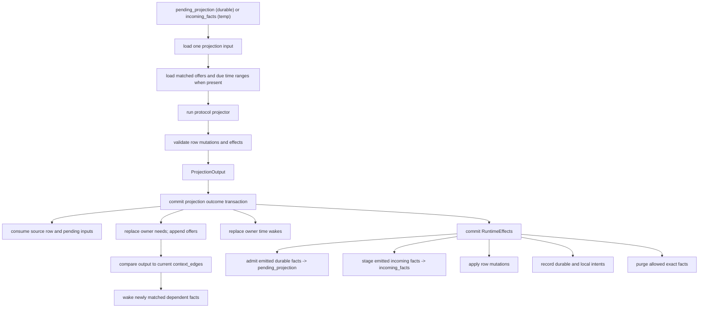
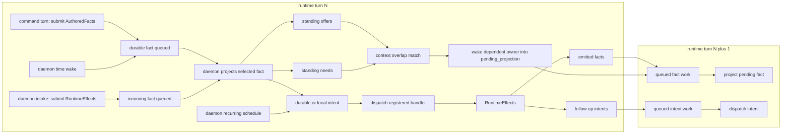
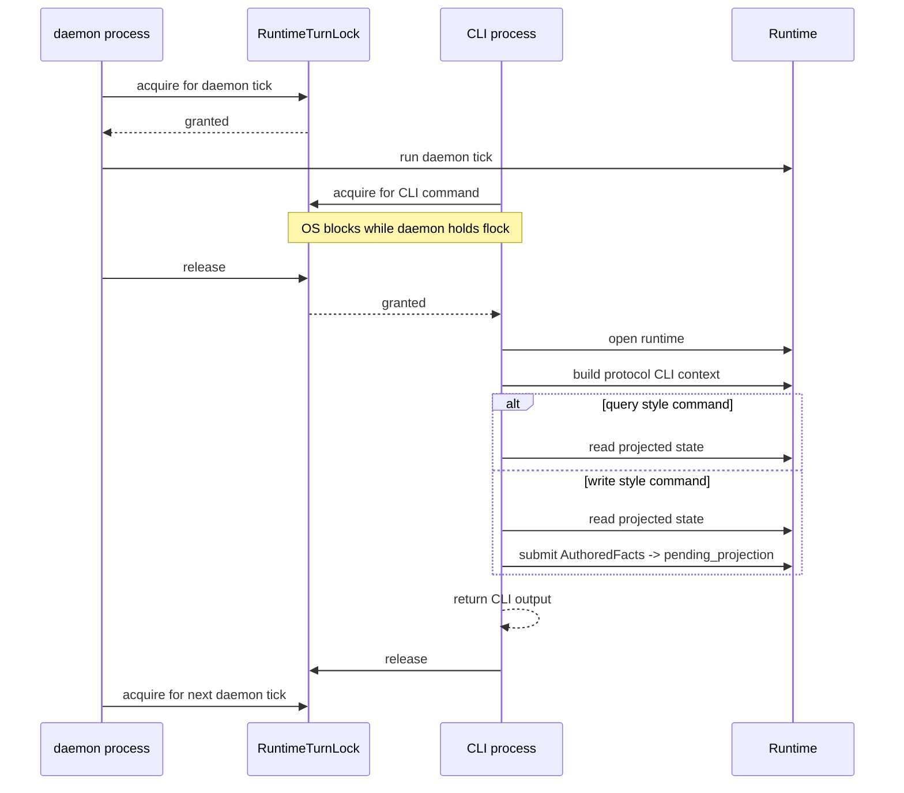

# Architecture Diagrams Alt

These diagrams describe the current poc-10 runtime shape in code terms. The
important distinction is that a daemon tick and a CLI invocation are separate
runtime turns. They do not call each other. They serialize through the same
`RuntimeTurnLock` for one database. The daemon owns queue-draining turns; CLI
commands own query/author/submit turns.

## Project One Fact

`Runtime::drain_durable_projection` and `Runtime::drain_incoming_projection`
both reduce one selected input to this per-fact path. Everything before the
commit is calculation. The commit consumes the selected durable pending row or
temporary incoming row and publishes replacement context, time wakes, rows,
facts, and intents.

## Daemon Queue Steps

Inside one daemon tick, recurring intents fire first, then inbound network and
time wakes feed the runtime queues. The daemon then runs the four named runtime
drains in policy order: durable projection, incoming projection, durable
intents, and local intents. The full `project one fact` path above is
represented here as a single node.

```mermaid
%%{init: {"flowchart": {"wrappingWidth": 300}} }%%
flowchart TD
    START["daemon::tick"] --> RECUR["fire due recurring intents -> local_intents"]
    RECUR --> INBOUND["accept frames -> receive_network_frame_effects"]
    INBOUND --> COMMIT_INBOUND["Runtime::submit_runtime_effects"]
    COMMIT_INBOUND --> TIME["admit due time_wakes"]
    TIME --> DURABLE_PROJECT["Runtime::drain_durable_projection(high local-derivation limit)"]
    DURABLE_PROJECT --> PROJECT_DURABLE["project one durable pending fact when present"]
    PROJECT_DURABLE --> MORE_DURABLE{"durable projection remains and budget remains?"}
    MORE_DURABLE -- yes --> PROJECT_DURABLE
    MORE_DURABLE -- no --> INCOMING_PROJECT["Runtime::drain_incoming_projection(high local-derivation limit)"]

    INCOMING_PROJECT --> PROJECT_INCOMING["project one incoming fact when present"]
    PROJECT_INCOMING --> MORE_INCOMING{"incoming projection remains and budget remains?"}
    MORE_INCOMING -- yes --> PROJECT_INCOMING
    MORE_INCOMING -- no --> DURABLE_INTENTS["Runtime::drain_durable_intents(base limit)"]

    DURABLE_INTENTS --> DURABLE_HANDLER["dispatch one durable intent when present"]
    DURABLE_HANDLER --> MORE_DURABLE_INTENTS{"durable intent remains and budget remains?"}
    MORE_DURABLE_INTENTS -- yes --> DURABLE_HANDLER
    MORE_DURABLE_INTENTS -- no --> LOCAL_INTENTS["Runtime::drain_local_intents(base limit)"]

    LOCAL_INTENTS --> LOCAL_HANDLER["dispatch one local intent when present"]
    LOCAL_HANDLER --> MORE_LOCAL_INTENTS{"local intent remains and budget remains?"}
    MORE_LOCAL_INTENTS -- yes --> LOCAL_HANDLER
    MORE_LOCAL_INTENTS -- no --> OUTGOING["pump network_outgoing"]
    OUTGOING --> DONE["return tick activity"]
```

## Turns, Matches, And Intents

A runtime turn is one exclusive period under `RuntimeTurnLock`. Work can remain
queued between turns. Commands can add durable pending facts, daemon intake can
add temporary incoming facts, and daemon ticks decide which queues drain.
Projection creates standing context. Newly added offers wake matching needs.
Projection and handlers both emit intents, and handlers can emit more facts, so
later turns may keep moving the same causal chain forward.

## CLI Commands Are Separate Turns

CLI queries and protocol commands use a separate entry point from the daemon
loop. They wait for the same runtime turn lock. Once they hold the lock, they
open the runtime directly and run a registered protocol CLI command. They do
not run daemon queue drains; write-style commands submit authored facts and
return after those facts are committed to `pending_projection`.

## Daemon Network Flow

The daemon owns background network progress. Another peer is abstracted here as
one node. Incoming network bytes are handed directly to the protocol's
`receive_network_frame_effects` intake hook, which returns runtime effects:
usually a local observation fact plus a temporary incoming frame fact. Outgoing
bytes are produced by protocol handlers and written by the core TCP pump.

```mermaid
%%{init: {"flowchart": {"wrappingWidth": 300}} }%%
flowchart LR
    PEER["another peer"] --> TCP_IN["TCP listener"]

    subgraph DAEMON["local daemon tick"]
        TCP_IN --> ACCEPT["accept_available"]
        ACCEPT --> INTAKE["receive_network_frame_effects"]
        INTAKE --> EFFECTS["submit_runtime_effects"]
        EFFECTS --> OBS["frame observation fact -> pending_projection"]
        EFFECTS --> FRAME_FACT["sealed frame fact -> incoming_facts"]
        FRAME_FACT --> PROJECT_FRAME["drain_incoming_projection opens frame with context"]
        PROJECT_FRAME --> RECOVERED["recovered protocol facts + receipts"]
        RECOVERED --> FUTURE_PROJECT["later durable projection"]

        FUTURE_PROJECT --> FOLLOWUP_INTENTS["sync or connection follow-up intents"]
        FOLLOWUP_INTENTS --> SEND_FACTS["send_facts_on_connection handler"]
        SEND_FACTS --> QUEUE_FRAME["queue_outgoing_frame handler"]
        QUEUE_FRAME --> OUTBOUND_ROWS["network_outgoing rows"]
        OUTBOUND_ROWS --> TCP_OUT["TCP pump"]
    end

    TCP_OUT --> PEER
```

