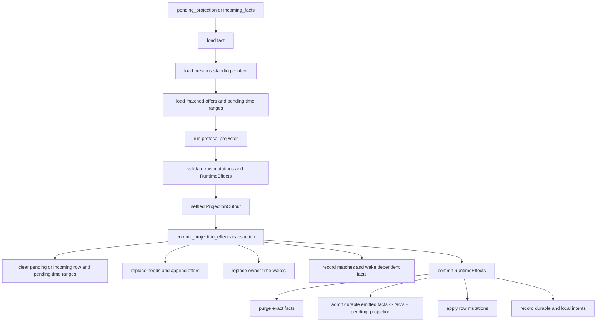
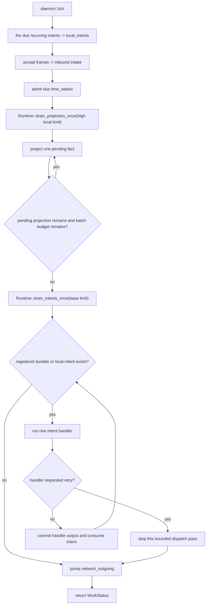
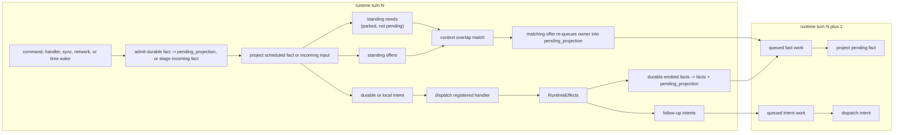
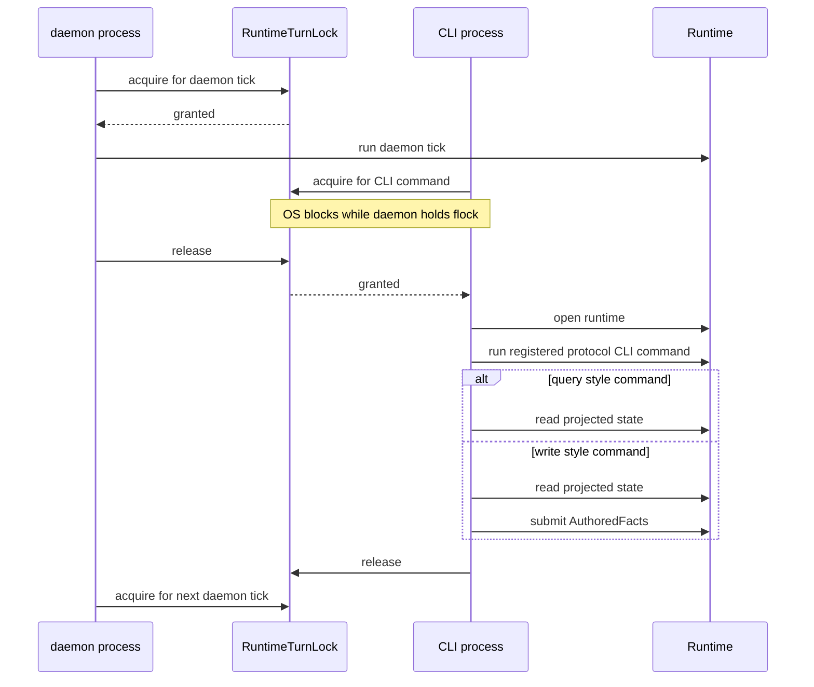

# Architecture Diagrams Alt

These diagrams describe the current poc-10 runtime shape in code terms. The
important distinction is that a daemon tick and a CLI invocation are separate
runtime turns. They do not call each other. They serialize through the same
`RuntimeTurnLock` for one database.

## Project One Fact

`Runtime::drain_projection_once` repeatedly reduces pending projection and
incoming fact work to this per-fact path. Everything before the commit is
calculation. The commit is the durable boundary that consumes the pending row
or incoming row and publishes replacement context, time wakes, rows, facts,
purges, and intents.

Newly emitted needs do not cause an in-memory projector fixed point. If a new
need overlaps an existing offer, core records the match and queues the owner for
a later projection item. Until that match happens, the owner is parked by its
standing need, not kept in `pending_projection`. Durable child facts emitted by
a projector are admitted to `facts` and marked in `pending_projection` in the
same transaction; they are not projected inline inside the parent's commit.
`RuntimeEffects::incoming_facts` is the separate temp staging path for
outside-origin inputs.

## Daemon Queue Steps

Inside one daemon tick, recurring intents fire first, then inbound network and
time wakes feed the runtime queues. The daemon then runs two explicit runtime
queue steps: one high-volume projection batch and one bounded intent batch. The
full `project one fact` path above is represented here as a single node.

Durable intent retry stops the bounded dispatch pass. Local intent retry rotates
the row to the tail, and dispatch may continue until it would retry the same
local intent again.

## Turns, Matches, And Intents

A runtime turn is one exclusive period under `RuntimeTurnLock`. Work can remain
queued between turns. Projection creates standing context. Newly added offers
wake matching needs. Projection and handlers both emit intents, and handlers can
emit more facts, so later turns may keep moving the same causal chain forward.

## CLI Commands Are Separate Turns

CLI queries and CLI commands use a separate entry point from the daemon loop.
They wait for the same runtime turn lock. Once they hold the lock, they open the
runtime directly and run a registered protocol CLI command. Ordinary commands
do not implicitly settle projection or dispatch; replay and diagnostic commands
are explicit runtime operations with their own command handlers.

## Daemon Network Flow

The daemon owns background network progress. Another peer is abstracted here as
one node. Incoming network bytes are delivered directly to the protocol intake
hook, which classifies recognized bytes into an incoming frame fact and a local
`frame_observation` fact. Outgoing bytes are produced by protocol handlers and
written by the core TCP pump.

```mermaid
%%{init: {"flowchart": {"wrappingWidth": 300}} }%%
flowchart LR
    PEER["another peer"] --> TCP_IN["TCP listener"]

    subgraph DAEMON["local daemon tick"]
        TCP_IN --> ACCEPT["accept_available"]
        ACCEPT --> INTAKE["receive_network_frame_effects intake"]
        INTAKE --> FRAME_OBS["frame_observation fact"]
        INTAKE --> FRAME_FACT["incoming connection frame fact"]
        FRAME_OBS --> DRAIN["run projection batch, then intent batch"]
        FRAME_FACT --> DRAIN

        DRAIN --> PROJECT_FRAME["project frame fact"]
        PROJECT_FRAME --> RECOVERED["recovered protocol facts"]
        PROJECT_FRAME --> RECEIPTS["connection_fact_receipt facts"]
        RECOVERED --> PROJECT_RECOVERED["project recovered facts"]
        RECEIPTS --> PROJECT_RECEIPTS["project receipts"]

        PROJECT_RECOVERED --> FOLLOWUP_INTENTS["sync or connection follow-up intents"]
        FOLLOWUP_INTENTS --> SEND_FACTS["send_facts_on_connection handler"]
        FOLLOWUP_INTENTS --> QUEUE_FRAME["queue_outgoing_frame handler"]
        SEND_FACTS --> OUTBOUND_ROWS["network_outgoing rows"]
        QUEUE_FRAME --> OUTBOUND_ROWS
        OUTBOUND_ROWS --> TCP_OUT["TCP pump"]
    end

    TCP_OUT --> PEER
```

