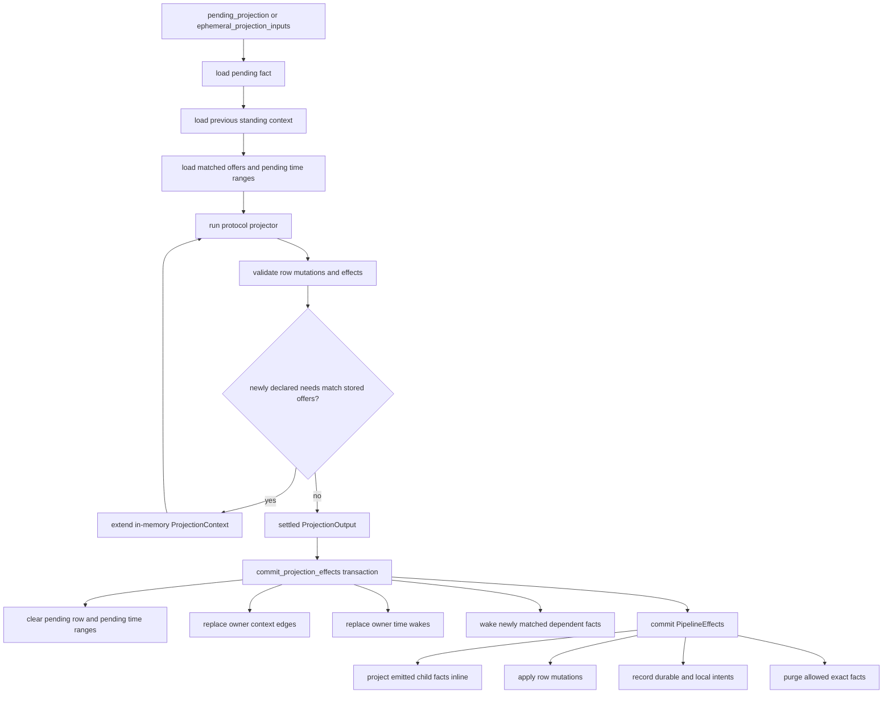
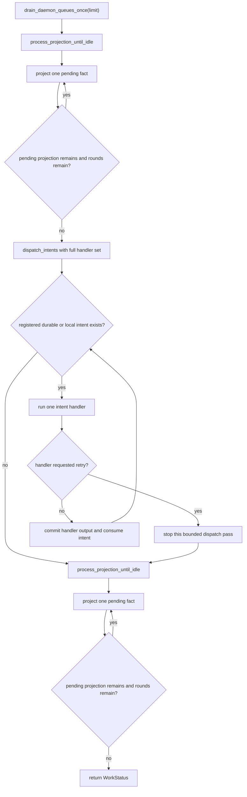
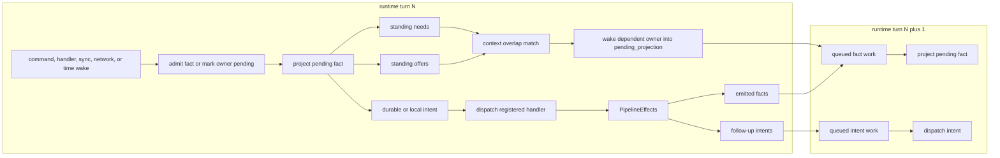
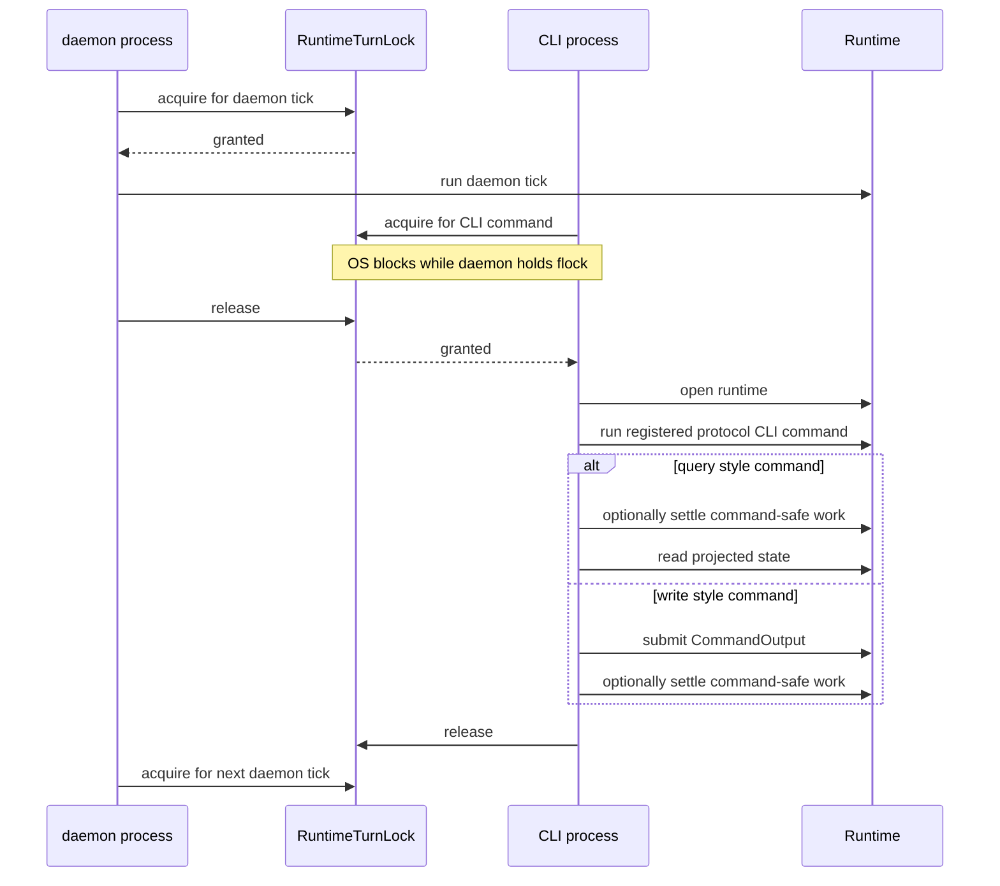

# Architecture Diagrams Alt

These diagrams describe the current poc-10 runtime shape in code terms. The
important distinction is that a daemon tick and a CLI invocation are separate
runtime turns. They do not call each other. They serialize through the same
`RuntimeTurnLock` for one database.

## Project One Fact

`drain_pending_projection` repeatedly reduces pending projection work to this
per-fact path. Everything before the commit is calculation. The commit is the
durable boundary that consumes the pending row and publishes replacement
context, time wakes, rows, facts, and intents.

## Daemon Queue Drain

`Runtime::drain_daemon_queues_once` is the daemon's queue-settling policy after
network IO and time wakes have been handled. The full `project one fact` path
above is represented here as a single node.

## Turns, Matches, And Intents

A runtime turn is one exclusive period under `RuntimeTurnLock`. Work can remain
queued between turns. Projection creates standing context. Newly added offers
wake matching needs. Projection and handlers both emit intents, and handlers can
emit more facts, so later turns may keep moving the same causal chain forward.

## CLI Commands Are Separate Turns

CLI queries and CLI commands use a separate entry point from the daemon loop.
They wait for the same runtime turn lock. Once they hold the lock, they open the
runtime directly and run a registered protocol CLI command. Command-side
settling is explicit work done by that CLI process; it is not a daemon tick
slot.

## Daemon Network Flow

The daemon owns background network progress. Another peer is abstracted here as
one node. Incoming network bytes are staged as opaque rows, converted into local
protocol intents, and later interpreted by registered handlers and projectors.
Outgoing bytes are produced by protocol handlers and written by the core TCP
pump.

```mermaid
%%{init: {"flowchart": {"wrappingWidth": 300}} }%%
flowchart LR
    PEER["another peer"] --> TCP_IN["TCP listener"]

    subgraph DAEMON["local daemon tick"]
        TCP_IN --> ACCEPT["accept_available"]
        ACCEPT --> INBOUND_ROWS["network inbound rows"]
        INBOUND_ROWS --> STAGE["convert inbound rows to local receive_network_frame intents"]
        STAGE --> DRAIN["drain daemon queues"]

        DRAIN --> RECEIVE_HANDLER["receive_network_frame handler"]
        RECEIVE_HANDLER --> FRAME_FACT["connection frame fact"]
        FRAME_FACT --> PROJECT_FRAME["project frame fact"]
        PROJECT_FRAME --> RECOVERED["recovered protocol facts"]
        RECOVERED --> PROJECT_RECOVERED["project recovered facts"]

        PROJECT_RECOVERED --> FOLLOWUP_INTENTS["sync or connection follow-up intents"]
        FOLLOWUP_INTENTS --> SEND_FACTS["send_facts_on_connection handler"]
        SEND_FACTS --> SEND_FRAME["send_network_frame handler"]
        SEND_FRAME --> OUTBOUND_ROWS["network outbound rows"]
        OUTBOUND_ROWS --> TCP_OUT["TCP pump"]
    end

    TCP_OUT --> PEER
```

