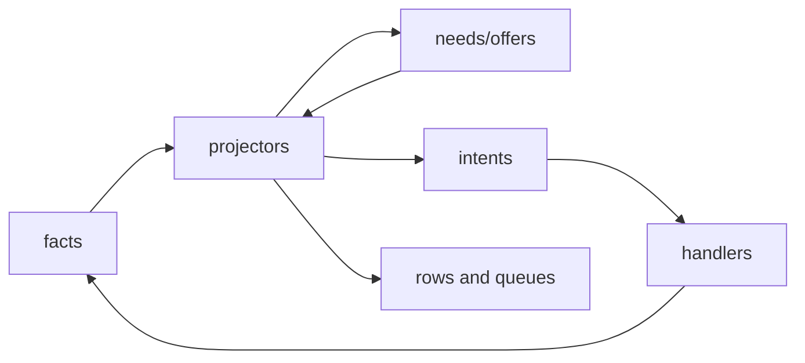

# Context

Context is a lightweight p2p engine for building [local-first](https://www.inkandswitch.com/essay/local-first/), end-to-end
encrypted collaboration apps. Its storage and wire protocol are made of facts
in the [Datalog](https://en.wikipedia.org/wiki/Datalog)/database sense: asserted ground records that can be stored,
matched, and projected. Context facts are immutable, fixed-layout records
admitted locally and exchanged between peers. A fact can be a message, invite,
membership change, sync request, receipt, key wrap, or connection handshake;
deterministic projectors validate facts against context and turn them into
[SQLite](https://www.sqlite.org/index.html) rows or bounded stateful work.

The result is a fact-based protocol runtime meant to be small enough to reason
about and complete enough to be the backend for a p2p Slack: team chat, invites,
membership, reactions, files, message history, sync, and frontend-friendly
queries without a custom middle layer.

The runtime keeps the p2p stack behind a boring local API. A client should be
able to ask for paginated message views with users, reactions, attachments, and
download progress while Context handles networking, auth, sync, projection, and
durable retry in one model.

## Quickstart

Understanding these source files should be enough to grasp the design:

1. [`src/core/project_fact.rs`](src/core/project_fact.rs): the core fact-to-state transaction. It shows how
   one queued fact is loaded with matched context, projected once, and committed
   as replacement needs, append-only offers, row mutations, emitted facts,
   purges, time wakes, and follow-up intents.
2. [`src/core/runtime.rs`](src/core/runtime.rs): the bounded turn scheduler. It shows the order shared
   by commands and daemons: recurring work, local and durable intents,
   projection queues, incoming fact staging, due time wakes, network intake, and
   outgoing network pumping.
3. [`src/core/handle_intent.rs`](src/core/handle_intent.rs): the stateful-work transaction. It shows how one
   durable or local intent is claimed, given exact fact inputs, routed to a
   handler, and committed atomically with queue consumption.
4. [`src/protocol/registry.rs`](src/protocol/registry.rs): the concrete protocol integration table. It
   wires fact tags, projectors, handler routes, recurring work, schema sources,
   row allowlists, and commands into the core runtime without putting protocol
   policy in core.
5. [`src/protocol/connection/request/project.rs`](src/protocol/connection/request/project.rs): a representative protocol
   projector. It shows fixed fact decoding, sealed request validation, parking
   on auth/local endpoint/ephemeral/receive context, and the handoff from
   deterministic projection into `create_connection` handler work.

### Run It

The binary is named `con`; when running through Cargo, pass CLI arguments after
`--`:

```bash
cargo test --lib
cargo run -- --help
```

Use a scratch database to create a local workspace and inspect the projected
state:

```bash
DB=/tmp/context-demo.db
cargo run -- --db "$DB" reset
cargo run -- --db "$DB" create-workspace Demo --username alice --devicename laptop
cargo run -- --db "$DB" workspaces
cargo run -- --db "$DB" state-summary
```

For live networking and daemon-host work, start a listener in one shell and
stop it from another:

```bash
cargo run -- --db "$DB" start --listen 127.0.0.1 41000
cargo run -- --db "$DB" stop
```

## Approach

In Context, a central idea is that facts offer context to other facts. Context
is a more general relationship than blocking: a context need can name an exact
fact, but it can also name a range of facts, and context
offers can be projected before the facts they refer to exist. That gives the
runtime a standing relationship surface. Later facts can wake when relevant
context appears, and earlier offers can satisfy later needs without hidden
callbacks or broad scans.



### Fact Projectors

A fact projector is the deterministic pipeline for one fact family. Core stores
immutable fact bytes, reads the first-byte type tag, and routes one fact at a
time to the projector registered for that tag. The projector receives the
primary `Fact`, the matched context that woke this projection item, due time
ranges, and replay/live mode. It does not query for missing dependencies, call
other projectors, run network IO, or update SQLite tables directly.

The projector's job is to explain what this one fact means under the context
currently available. A typical projector decodes the fixed layout, checks the
fact id and scope, validates signatures or encryption/container shape, adapts
any retained legacy payload form, inspects matched context payload facts, and
then returns a complete projection output. That output can materialize rows,
publish context offers, declare future needs, schedule time wakes, emit new
facts, queue intents, or purge exact facts. Core commits that output
atomically.

```text
fact bytes
  -> tag route
  -> projector(primary fact + matched context + due time ranges)
  -> ProjectionOutput
  -> core commit: replace needs/time wakes, append offers, mutate rows,
     admit emitted facts, queue intents, wake matched owners
```

Missing context is ordinary control flow. If a message projector cannot yet
prove its signer, author, key coverage, deletion state, or retention floor, it
returns needs for exactly those proofs and no final message row. Core records
those needs and the fact is parked. When an endpoint, user, key-wrap, deletion,
or retention fact later projects a matching offer, core requeues the message and
attaches the matched payload as projection context. The message projector then
validates that payload for the current message before trusting it.

This is why projectors are the narrative center of a fact family. They decide
which evidence is enough, what missing evidence should wake them later, which
rows become visible, what context this fact offers to others, and which bounded
stateful work should run as an intent. The next section describes the standing
need/offer rows that let core wake those projectors without understanding the
protocol meaning of the evidence.

### Needs And Offers

Every context row is either a need or an offer. A need says "wake and
reproject this owner fact when matching context appears." An offer says "this
owner fact can be loaded as payload context for matching needs." Both have
the same matching shape: owner fact id, role, fact scope, and an inclusive byte
range. Core only matches role/scope/range overlap and loads the offer owner as
payload; the woken projector decides whether that payload actually proves what
it needs.

Matching is not a separate stage or a background scan. It runs inside each
projection commit: when a projector's output commits, core matches the needs
and offers that output just added against the already-stored set, records the
overlaps, and re-queues the owners they wake. A later fact's commit is therefore
what wakes an earlier parked fact, and an earlier offer is already stored to be
matched the moment a later need commits.

Readable examples look like this; real keys are canonical protocol bytes:

```text
need
  owner: fact:content_message:7f2a
  role: content_signer
  scope: workspace:acme
  range: endpoint:alice_phone..endpoint:alice_phone
offer
  owner: fact:endpoint_shared:51de
  role: content_signer
  scope: workspace:acme
  range: endpoint:alice_phone..endpoint:alice_phone

need
  owner: fact:connection:c810
  role: connection_fact_receipt
  scope: local
  range: fact:connection:c810..fact:connection:c810
offer
  owner: fact:connection_fact_receipt:03db
  role: connection_fact_receipt
  scope: local
  range: fact:connection:c810..fact:connection:c810

need
  owner: fact:content_message:9af3
  role: secret_coverage
  scope: workspace:acme
  range: (frontier:room_key_v4, minute:28583333, leaf:9af3)..same
offer
  owner: fact:local_history_node_secret:6e15
  role: secret_coverage
  scope: workspace:acme
  range: (frontier:room_key_v4, minute:28583280, leaf:9a00)
      ..(frontier:room_key_v4, minute:28584600, leaf:9aff)
```

Because context is projector-described evidence, it is more powerful than a
Boolean dependency block. A projector decides which context proves the fact,
whether missing context parks or rejects it, whether derived state is durable or
ephemeral, what context it offers to later facts, what future context should
wake it, and which bounded intents should run. Core stores facts, matches
context, schedules wakes, and commits declared effects; the narrative for what
happens when a fact exists stays in the owning projector.

Protocol aspects such as connection, sync, and auth are all described as
facts. Connection handshakes, sealed frame receipts, sync compares, key wraps,
workspace authority, messages, deletions, and retention policy are admitted and
projected through the same fact model. This gives the project a consistent way
to reason about concurrency and network interaction: bytes from another node
enter as facts, core matches context, the owning projector validates meaning,
and handlers perform bounded stateful work.

The current architecture has a small vocabulary:

```text
facts
context needs
context offers
projectors
intents
intent handlers
runtime work queues
protocol scopes
```

The system has one fact store, one context matching surface, one projection
scheduler, one intent scheduling surface, and one product-facing binary:
`con`.

## Architecture Principles

The current architecture is described by these boundaries:

- **Core mechanics.** Core owns protocol-neutral mechanics: facts, context,
  command authoring primitives (`src/core/command.rs`), byte-range context
  matching, generic runtime/app mechanics, pending fact processing, context wake
  fanout, intent dispatch, storage mechanics, wire field primitives, network
  queues, TCP, command-time authoring, and crypto helpers.
- **Scope semantics.** Protocol scopes own fact semantics: layouts,
  projectors, context
  roles/ranges, command constructors, read-model rows, queries, CLI adapters,
  and protocol validation rules.
- **Scope manifests.** `src/protocol.rs` and `src/protocol/<scope>.rs` are
  manifests. A scope manifest declares its fact families and intent handlers in
  one place.
- **Handler work.** Intent handlers own bounded stateful work and handler
  checkpoint state.
- **Projector output.** Projectors return needs, offers, time wakes, row
  mutations, and intents.
- **Handler output.** Intent handlers return facts, purged facts, row
  mutations, and intents. Purge output remains a bounded core-owned escape
  hatch for exact fact removal, not a broad storage API.
- **Runtime isolation.** No fact module, intent handler, command, schema, or
  wire layout reaches around core to call another stage directly.
- **Durable queues.** Runtime coordination is explicit and durable where it
  needs to survive restart: pending facts, time wakes, durable intents, and
  ephemeral intents are named queue surfaces rather than hidden callbacks.
- **Explicit schemas.** Schema declarations are explicit SQL DDL in the owning
  Rust modules:
  `src/core/schema.rs`, `src/core/network.rs`, and
  `src/protocol/registry.rs`.
- **Fixed layouts.** Wire layouts are declarative and fixed length. There are
  no variable payload slots except bounded, canonical slots explicitly modeled
  by a fact layout.

## Runtime Shape

`src/main.rs` delegates to the product app boundary. Protocol manifests declare
their commands, fact families, intent handlers, schemas, and runtime-turn hooks;
the app assembles those declarations into a `ProtocolDescription` and passes it
to core. Core uses that description to build the `con` CLI, open the declared
runtime, run bounded runtime turns, and dispatch registered protocol commands
without hard-coding their names or behavior.

Runtime turns are serialized per database to avoid races between command-created
facts and ongoing projection or intent activity. Daemon ticks and normal
protocol CLI commands both acquire `<db>.runtime.lock` before entering the
runtime. Each host runs the same bounded turn first; daemon turns supply network
adapters and dispatch durable handlers, while command/query turns run without
durable handler dispatch, listener, or outgoing pump adapters. This means a
command cannot admit facts while another turn is draining pending facts, matching
context, committing projector output, or running handlers. The daemon releases
the turn after each bounded tick; CLI commands wait for the next turn, and
`reset` removes the runtime lock file along with the database and daemon lock
files.

Runtime work moves through these core-owned queues:

```text
command output
  -> authored facts
  -> pending_projection
  -> projector
  -> replacement needs + append-only offers + row mutations + follow-up intents
  -> durable or ephemeral intent queue
worker/daemon
  -> registered handler
  -> committed RuntimeEffects
```

Command-authored facts and intent-created facts skip the incoming intake table:
core retains them in `facts` and `local_fact_admissions`, then marks them in
`pending_projection` in the same transaction. Outside-origin bytes first enter
core's temporary `network_incoming` queue, then the daemon classifier stages
recognized facts in `incoming_facts`. Runtime loads those facts into the owning
projector, and projector output either deletes the incoming row or retains it as
a normal fact when it must park on context or become protocol evidence.

Commands do not privately project their own writes after authoring them. Before
dispatch, a command/query turn gives recurring builders, projection, time wakes,
and local intent handlers a bounded chance to advance. It leaves durable handler
dispatch to daemon-host turns because durable handlers may emit network rows.
Then the command reads the current projected state, authors all facts from that
snapshot, commits those facts atomically, and returns its receipt. Later
visibility is normal runtime work: any later turn can drain bounded projection
and local intent batches, while daemon turns additionally handle durable intents,
admit incoming network facts, and pump network output. Tests and CLI flows that
observe projected state should keep running turns and assert eventually.

User query-facing commands read the projected state already visible to the user.
If an authoring command needs additional facts before its rows can eventually
materialize, it authors those facts in the same in-memory command chain instead
of querying its own writes. Handler-created facts remain daemon/replay work, not
part of a command-local settle loop.

Local operational settings follow the same rule. For example, `sync range`
authors a local sync-setting fact and commits it; a later runtime turn projects
the setting, and the recurring sync loop reads that projected row during a
daemon-host turn to perform compare/have/need/fact-send work. A setting command
changes durable facts, not the handler queue.

Network input is accepted by core's TCP listener into memory-local
`network_incoming` rows with origin metadata. The daemon drains those rows
through the protocol-declared inbound classifier, which returns typed facts for
the temporary `incoming_facts` first-pass queue. Projectors decide what, if
anything, becomes durable. If receive metadata must survive parking or replay,
the projector emits ordinary durable observation or receipt facts that encode it.
Network output is produced by protocol handlers as opaque frame bytes addressed
to a `SocketAddr`. Core stores those bytes in memory-local `network_outgoing`
rows, keeps active peer addresses in `network_outgoing_targets`, and lets the
daemon TCP pump write and delete frames as socket capacity allows.

## Protocol Versioning

Protocol versioning is a protocol scope, not a core feature flag. The detailed
rules and update loop live in
[`src/protocol/versioning/README.md`](src/protocol/versioning/README.md); the
short version is that protocol code owns the release marker, the update fact,
and the rules for rebuilding materialized state, while core only enforces the
storage-requirement guard it is handed.

There are two related concepts to keep separate. `CURRENT_PROTOCOL_VERSION` in
`src/protocol/versioning.rs` is the version this checkout expects projected
storage to have. The database stores its latest projected marker in
`protocol_version_rows`, a protocol-owned row table declared through the normal
schema sources. Separately, each projector, handler, or query can declare the
storage version it expects before it touches materialized state. Core can
enforce those requirements at projection and handler commit boundaries; query
modules must check their own read preconditions before reading tables directly.

Repair is ordinary runtime work. Each bounded turn gives the recurring
`check_version` builder a chance to compare the stored marker with
`CURRENT_PROTOCOL_VERSION`. If the marker is missing or stale, the handler
authors a priority local `local_update` fact. Live projection of that update
fact records protocol-visible update history, advances the marker, requests a
rebuild, clears schema-declared resettable runtime/materialized state, preserves
retained facts, and requeues retained facts for replay projection. Replay of an
old update fact is a no-op; previous update facts remain history, not commands
that rerun.

This keeps compatibility policy with the fact families that own it. Current
projectors must still decode and project retained durable fact types that can
remain in `facts`, but they must write only the current materialized table
shape. If code is newer than the stored marker, guarded ordinary work consumes
stale selected queue rows without publishing old-shape effects until the update
loop repairs storage.

## Scope Layout

Fact families are organized by protocol scope. The grouping is mostly arbitrary
to core: core receives the manifests, type tags, projectors, handlers, schemas,
and commands that the app declares. For protocol code, scopes act like
module-like families. They keep related facts, rows, context roles, commands,
queries, and handlers near each other and give each group a clear realm of
responsibility.

```text
src/protocol.rs
src/protocol/registry.rs

src/protocol/auth.rs
src/protocol/auth/

src/protocol/content.rs
src/protocol/content/

src/protocol/connection.rs
src/protocol/connection/

src/protocol/sync.rs
src/protocol/sync/

src/protocol/versioning.rs
src/protocol/versioning/
```

Each fact family owns its fact type, fixed wire layout, command constructors,
projector, rows, queries, and CLI adapter if it has one. Each intent handler is
a verb-named file directly under its scope.

## Protocol Function Boundaries

The protocol separates durable data, deterministic derivation, bounded
stateful work, byte syntax, and transport sessions. Keeping those functions
separate makes it clear which component is allowed to interpret bytes, wait for
context, touch external IO, or commit state.

### Projectors

Projectors are the deterministic derivation path from one fact to local state.
They decode the primary fact, check scope and structure, declare exact context
needs, validate matched context, and return replacement needs, append-only
offers, and materialization effects. They are separate from handlers because
missing context parks projection, while IO and stateful work belong in queued
intents.

Deletion is target-owned: a target fact keeps the need or time wake that can
remove it, and when that context appears it deletes only its own rows and may
purge only itself.

### Intent Handlers

Intent handlers are the bounded stateful work path. They decode one queued
intent, name exact fact inputs for core to load, perform one effect, and return
`RuntimeEffects`. They are separate from projectors so network sends,
key-wrap creation, sync responses, and other stateful work have a distinct queue
row and an atomic commit boundary with queue consumption.

### Wire Layouts And Codecs

Wire layout code is the byte syntax boundary. It uses `core::wire` primitives
for fixed ids, hashes, keys, signatures, nonces, integers, tags, and bounded
slots, and it rejects wrong tags, wrong lengths, trailing bytes,
non-canonical padding, and invalid enum values. It is separate from projection
so byte compatibility stays local to the owning fact module while semantic
admission remains in the projector.

### Connection Frames

Connection frames are the transport envelope boundary. They are opaque
fixed-size byte envelopes until opened by a connection projector with exact
connection context. They are separate from auth, content, and sync semantics:
frames move bytes and produce receipts, while the owning fact projector
validates every recovered fact.

Byte-wise, those envelopes are still facts. Core writes canonical
connection-family fact bytes to the socket: sealed `request` and `connection`
facts during the handshake, then `frame_small`, `frame_file_slice`, or
`frame_bundle` facts for established traffic. Established frame facts contain
sealed slots filled with the selected child fact bytes, and opening a frame
re-admits those child bytes as ordinary incoming facts.

This keeps core's network interface minimal. Core owns TCP accept/write
mechanics, the volatile outgoing frame queue, and the active-target scheduling
index. It does not know whether a byte string is a bootstrap request, bootstrap
response, established connection frame, auth fact, sync fact, or content fact.
On ingress, the daemon stages accepted bytes in the core incoming queue; the
connection scope classifies the frame, emits the right incoming wrapper fact,
and lets connection projectors open it with incoming metadata plus auth or
connection context. Opened payloads re-enter projection as incoming child facts
so their owning projectors decide admission, and receipt or observation facts
record which connection delivered retained facts plus replay-safe origin
metadata.

Egress is the same boundary in reverse. Sync may decide that a fact id should
be sent to an authorized connection, but the connection scope decides how to
load, filter, batch, seal, and address those facts as connection frames.
Handlers that already know the peer address queue opaque bytes directly in
`network_outgoing`; `network_outgoing_targets` records that the address has
queued work. When projection has sealed bytes but no right to mutate core's
network queue directly, it emits `queue_outgoing_frame`, which resolves the
connection row to a `SocketAddr` and fills the same outgoing queue. Core's
daemon pump schedules active target addresses, writes length-prefixed frames
from the per-target queue, and deletes each frame row only after it has been
fully written. Connection rows and receipt facts preserve the durable
relationship between those bytes, the session, recovered incoming facts, and
origin observations.

### Simplicity Guardrails

Production work is represented with immutable facts, standing context,
time-wake schedules, pending projection, durable intents, and ephemeral intents.
Protocol progress is visible through those mechanisms and through schema-owned
rows. The declared runtime work surface is complete: production state enters as
facts, context, time wakes, intents, or schema-owned rows.

## Documentation

Active design and maintenance docs are:

- [README.md](README.md): architecture overview and protocol function boundaries.
- [ARCHITECTURE_DIAGRAMS.md](ARCHITECTURE_DIAGRAMS.md): GitHub-renderable
  architecture flowcharts.
- [docs/RULES.md](docs/RULES.md): architecture rules, projector rules, and
  guardrails.
- [docs/todo-add-verus-proofs.md](docs/todo-add-verus-proofs.md): TODO plan
  for adding Verus proofs.
- [src/core/README.md](src/core/README.md): core/runtime responsibility boundaries, including
  projection and handler commit boundaries.
- [src/protocol/README.md](src/protocol/README.md),
  [auth](src/protocol/auth/README.md),
  [content](src/protocol/content/README.md),
  [connection](src/protocol/connection/README.md),
  [sync](src/protocol/sync/README.md), and
  [versioning](src/protocol/versioning/README.md): fact-scope
  responsibilities, facts, handlers, row state, and cross-scope interfaces.

Planning notes live under `docs/archived/`.
