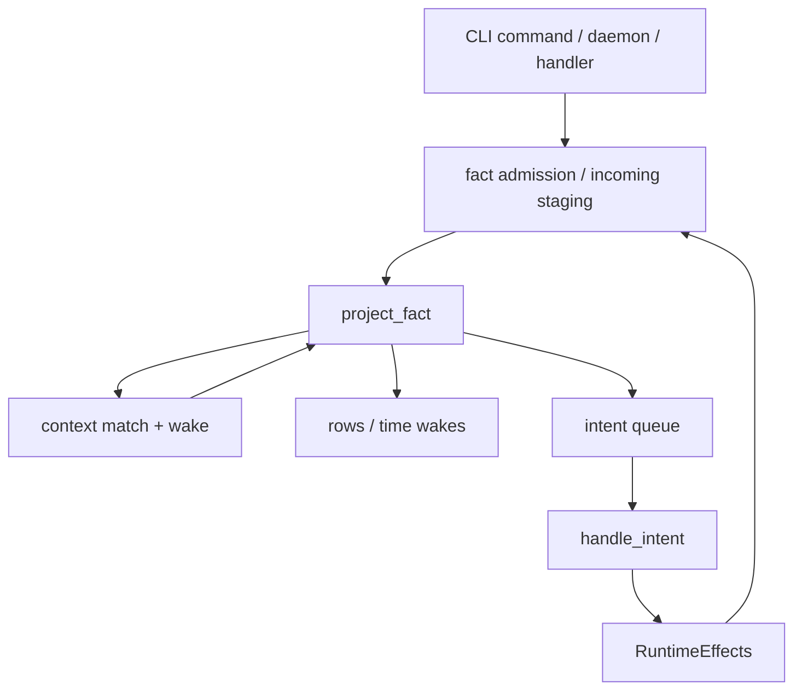
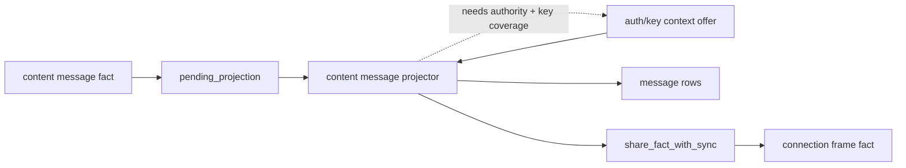

# Core

Core is the protocol-neutral runtime substrate. A different protocol should be
able to reuse it unchanged: core persists immutable facts, matches context
ranges, runs projectors, dispatches queued intents, commits effect batches,
hosts CLI and daemon process loops, and moves opaque network bytes. Commands,
wire formats, transit-layer security, connection bootstrapping, sync policy,
fact relationships, data semantics, storage materialization, and read models
belong to the protocol. In a messaging app, for example, core must not know what
a workspace, message, invite, key wrap, sync range, or connection fact means.

## Quickstart

If a reader understands these five files, they understand the core design:

1. [`project_fact.rs`](project_fact.rs): the central projection transaction. It shows how one fact
   becomes replacement needs, append-only offers, time wakes, row mutations,
   emitted facts, purges, and follow-up intents.
2. [`runtime.rs`](runtime.rs): the bounded turn scheduler. It composes projection, intent
   dispatch, time wakes, incoming fact staging, network pumping, recurring work,
   and the runtime lock into the same host turn used by commands and daemons.
3. [`handle_intent.rs`](handle_intent.rs): the queued stateful-work transaction. It shows how core
   claims one durable or local intent, loads exact fact inputs, runs a protocol
   handler, and commits successful output atomically with queue consumption.
4. [`../protocol/content/message/project.rs`](../protocol/content/message/project.rs): a representative protocol
   projector for ordinary materialized content. It demonstrates the protocol
   side of decoding, context proof, semantic validation, row output, and
   follow-up work while core stays protocol-neutral.
5. [`../protocol/connection/request/project.rs`](../protocol/connection/request/project.rs): a representative protocol
   projector for connection intake. It demonstrates parked context, sealed
   payload opening, authority checks, local-versus-durable effects, and network
   follow-up around core's same projection contract.

## How Core Works

Core is the reusable runtime loop around a protocol declaration. At startup the
app hands core a `ProtocolDescription`; core opens the selected SQLite database,
applies core, network, and protocol schemas, builds the command registry, and
constructs a `Runtime` from the declared projector, handler registry, row
allowlist, schema sources, and runtime-turn hooks. From that point on, core does
not ask what a protocol fact means. It only moves facts, context, rows, intents,
time wakes, and opaque network bytes through the declared runtime workers.

A normal command is a serialized database turn. Core opens the database, passes the
current projected state and command clock to protocol command code, and commits
the command's authored facts. Core persists their immutable bytes, records local
admission metadata, and marks them pending for projection. The command can
return human-readable `CliOutput`, but command-authored durable protocol state
must enter through facts; rows, purges, and intents come from later projection
or handler work.

Protocol reads observe the currently projected rows. They do not privately drain
projection before reading, and authoring commands do not read their own writes
through projection. If one command authors several facts, it chains through the
in-memory facts and receipts it just built. Incoming facts, time wakes,
projection, and handler-derived rows are worker/daemon progress; callers that
need those effects observe them eventually through the normal runtime loop.

Projection is core's deterministic reaction step. Core drains
`pending_projection`, loads one fact and the matched context attached to that
pending row, resolves any newly declared needs that already match stored offers,
calls the protocol projector once, and commits the complete output.
That commit replaces the fact's owned needs and time wakes; appends newly
emitted offers as durable evidence; applies allowed row mutations; admits
emitted facts; queues follow-up intents; and wakes other fact owners whose
standing needs now overlap newly added offers. Core performs the overlap query
mechanically when it queues the work, but projectors decide what the matched
offer value proves.

Intents are core's bounded stateful work step. A projector or explicit runtime
operation emits an intent when the next action should not happen inside
deterministic projection: sending bytes, building a response fact, creating a key
wrap, seeding sync, or performing any other bounded stateful action. Core claims
one durable or local intent, loads only the fact inputs declared by that handler,
calls the registered handler, and commits successful handler output atomically
with queue consumption. Handler rejection consumes the terminal invalid row
without output. Validation errors keep the row queued. A storage-version
mismatch consumes the selected row without running handler-owned SQL or
committing ordinary effects.

Every host runs the same bounded runtime turn before it does host-specific work.
Each turn gives recurring builders an opportunity, drains local intents and
durable projection, admits due time-wake ranges as pending projection, drains
incoming projection, and leaves any handler-emitted facts queued for later
projection work. The daemon supplies network host adapters, so daemon turns also
dispatch durable handlers, accept frames into `network_incoming`, drain those
raw rows through the protocol classifier into `incoming_facts`, and pump queued
outgoing TCP frames.
Command/query turns run without durable handler dispatch or network adapters.
The runtime lock ensures a daemon turn cannot race with a CLI command that is
admitting new facts into the same database.

Core's job is therefore coordination, persistence, and mechanical validation.
It owns the serialized turn shape, SQLite transaction boundaries, queue
ordering, bounded drain status, idempotent fact admission, queued intent
admission,
protocol-blind context matching, network byte pumping, and schema/row allowlist
checks. It leaves protocol meaning in the protocol scopes: fact layouts,
authority checks, sync policy, connection-frame opening, read-model rows,
commands, and queries.

## Interface To Protocol

Protocol code enters core through declarations and effect values:

- `runtime::RuntimeDescription` declares protocol schema sources, allowed row
  mutation tables, the projector factory, and registered intent handlers.
- `runtime::RuntimeTurnDescription` declares host-turn intake: how inbound
  network bytes become incoming facts and which time-wake timelines live turns
  admit.
- `app::ProtocolDescription` adds the product name, runtime-turn declaration,
  CLI command table, and context builder.
- `project_fact::Projector` receives one `Fact` plus a `ProjectionContext` and
  returns a `ProjectionOutput`; fact families keep decode, authenticate, adapt,
  and semantic projection helpers inside their owning `project.rs`.
- `intents::IntentHandler` receives one queued `Intent` plus a
  `HandlerContext` containing only the intent's attached input facts and
  returns `RuntimeEffects`.
- `command` defines the protocol-neutral command clock, local capability value
  types, and authored fact bundles. User-facing commands receive `Db` and
  `CommandClock` directly when they need current projected state before
  authoring facts.
- `effects::RuntimeEffects` is the shared language for projector and handler
  facts to admit durably, incoming facts to stage for projection, purges, row
  mutations, durable intents, and local intents.
- `db::SchemaSource` lets core, network IO, and protocol registry code
  declare SQL DDL, an optional storage-version marker source, opaque row-table
  allowlists, and rebuild lifecycle for retained fact storage, resettable
  runtime state, and state-summary tables.

Data leaves core through the same narrow surfaces: commands receive
`CliOutput`, protocol queries read schema-owned rows through `Db`, daemon-host
runtime turns receive length-prefixed frame bytes, and network sends consume
opaque outgoing rows from `network`.

## Data Flow



Facts can enter through commands, handlers, sync, or incoming daemon-host input.
Core records durable fact bytes with admission metadata and retained
`pending_projection` work; outside-origin bytes are staged in the temporary
`incoming_facts` first-pass queue until runtime loads them into the owning
projector.
Projection is the only path from fact bytes to standing context, read-model
rows, time wakes, and follow-up work. Runtime work can stage incoming facts in
`incoming_facts`, submit local (ephemeral, not-replayed) intents to
`local_intents`, and mark facts whose scheduled wake-up time has arrived as
pending projection work.
Any runtime effect that wants more fact projection goes through durable fact
admission or incoming_facts staging; core does not let protocol code call a
projector directly.

Network bytes enter through the TCP listener and are first staged in the
temporary `network_incoming` queue with origin and receive-time metadata.
Recognized frame bytes then become temporary `incoming_facts`; the incoming
metadata is attached to `ProjectionContext`. The owning projector decides
whether each incoming frame fact is retained while it waits on connection or key
context, becomes durable evidence, or is dropped after one-shot projection
succeeds. Outgoing bytes are produced by protocol handlers, staged as
per-target `network_outgoing` frame rows, and written by core's TCP pump without
parsing frame payloads. A separate `network_outgoing_targets` index names active
addresses so the pump schedules peers without scanning frame payloads. The pump
writes length-prefixed frames as socket capacity allows and deletes each frame
row only after its frame is written.

Time enters through runtime-owned `RuntimeTimeWake` declarations. The current
host turn selects due `time_wakes`, attaches the due `TimeRange` to projection
context, and lets the owning projector decide whether that time proves anything.

## Invariants

- Fact ids are deterministic [BLAKE3](https://www.blake3.io/) hashes of immutable fact bytes. Scope and
  timestamp are local admission metadata, not part of content identity.
- Context rows are standing state owned by one fact. A projection output
  replaces the previous needs and time wakes for that owner, while newly emitted
  offers append as durable evidence until the owner fact is purged.
- Context matching is protocol-blind range overlap over `(role, scope,
  start_key, end_key)`. Projectors must decode and validate matched offer
  values.
- Projectors do not query the database, perform IO, call handlers, or mutate
  process-local state.
- Each intent queue insert records a distinct row id. `kind` routes to a
  handler; `key` and `payload` are handler-owned bytes. Duplicate suppression
  belongs in facts, protocol rows, network queues, or handler-local state.
- Handler output commits atomically with deletion of the handled queue row.
  Handler rejections consume the invalid row without output; validation errors
  leave the row queued without committing output. Storage-version mismatches
  consume the selected row before handler-owned SQL or effects can run.
- Projection mode is sticky toward replay. If an owner is already queued in
  replay mode, later normal wakes do not downgrade it.
- Needs are replacement subscriptions. The committed `ProjectionOutput` is the
  complete standing need set for that fact; emitting no needs marks the fact no
  longer parked on context.
- Durable offers are append-only evidence. Once a fact offers context, that
  offer remains until the fact is purged.
- Rejected durable projection items do not stall the batch. Context-free
  rejection purges the fact; context-dependent rejection keeps the fact bytes as
  evidence and clears only the pending row.
- Incoming facts start as temp first-pass queue rows. A projector may keep an
  incoming fact retained while parked on standing context needs, retain it as
  protocol evidence, or drop it.
- Typed-table inserts are idempotent only when the existing row matches every
  supplied column; changing typed projection state is expressed as
  `DeleteWhere` followed by `InsertValues`.
- Row mutations are accepted only for tables declared by the selected runtime.
  The module that builds a row owns its columns, key bytes, and semantics.
- Storage-version requirements are commit guards. A projector or handler route
  can attach `StorageRequirement::Current(version)` to its effects; core reads
  the `StorageVersionSource` declared by the active schema and compares that
  marker with the required version before it runs handler-owned SQL or publishes
  ordinary effects. Mismatch consumes the selected queue row without those
  effects.
  `StorageRequirement::MaintenanceBypass` is reserved for repair work that must
  run while the marker is stale.
- Db is below policy. It applies schemas, transactions, and row helpers; it
  does not interpret protocol rows, facts, context roles, or sync ranges.

## Responsibility Boundary

Change core when the reusable runtime mechanics change: queue ordering,
projection scheduling, context overlap matching, transaction boundaries,
effect validation, wire primitives, database behavior, network byte pumping,
daemon lifecycle, runtime-turn scheduling, or CLI hosting.

Change protocol when the meaning of a fact, row, context role, command, sync
range, invite, key, message, or connection frame changes. Protocol modules may
use core syntax and contracts, but core must not import their semantic rules.

## Module Map

### Top-Level Files

The files are ordered by the path a maintainer should usually read first, not
alphabetically.

- `project_fact.rs`: one queued fact projection transaction plus fact lifecycle
  SQL. It admits retained and incoming facts, queues pending projection, loads
  matched context and due time ranges, runs the routed projector, applies source
  rules, purges exact fact-owned state, wakes matched owners, and commits
  emitted effects. Standing context SQL lives under `project_fact/context_db.rs`.
- `runtime.rs`: executable engine for one selected protocol description. It
  opens databases, applies declared schemas, submits authored facts, exposes
  bounded projection and intent queue drains, owns the runtime-turn lock, admits
  due time wakes, stages inbound network bytes as incoming facts, pumps outgoing
  network rows when a daemon host supplies a listener, and composes
  `project_fact.rs` and `handle_intent.rs` into bounded runtime turns.
- `handle_intent.rs`: one queued intent transaction. It claims one durable or
  local intent, loads only the intent's attached fact inputs, calls the
  registered handler, and commits successful handler output atomically with
  queue-row deletion. It also drops terminal invalid intent rows, owns handler
  route metadata, handler sets, recurring intent declarations, and dispatch
  context.
- `daemon.rs`: long-running process lifecycle. It owns daemon start flag
  parsing, the daemon process lock, listener setup, readiness output,
  signal/stop/reset handling, idle sleep, and tick cadence. It receives a turn
  closure from `app.rs` and repeats it with the live listener; it does not define
  projection, intent, time-wake, or network queue order.
- `db.rs`: SQLite substrate below runtime policy. It applies schema batches,
  opens transactions, quotes identifiers, reads schema-declared storage-version
  markers, and applies typed row mutations. It does not know what a fact tag,
  context role, network frame, or protocol row means.
- `schema.rs`: core-owned SQL table inventory. It declares facts, local
  admissions, context edges, time wakes, pending projection, incoming facts,
  pending projection matches, the `pending_time_ranges` work table, intent
  queues, local network tables, and rebuild reset groups. Protocol rows live in
  protocol schema sources.
- `effects.rs`: shared effect language for projectors and handlers.
  `RuntimeEffects` names facts to admit, incoming facts, exact purges, row
  mutations, durable intents, and local intents. The shared commit helper writes
  this mechanical description atomically inside the caller's transaction and
  rejects follow-up intent kinds that are not in the active handler registry.
  Commands use `AuthoredFacts` facts plus a receipt instead.
- `intents.rs`: queued work and handler contract types. It defines durable and
  local intent identity, attached context fact ids, opaque payloads, row
  mutation values, handler errors, and the rule that handlers return
  `RuntimeEffects` instead of mutating runtime state directly.
- `context.rs`: public vocabulary for standing context relationships. It
  defines needs, offers, roles, opaque byte keys, canonical key construction,
  replacement need subscriptions, append-only offer evidence, and the
  protocol-blind overlap rule that lets core wake facts without understanding
  their semantics.
- `facts.rs`: protocol-neutral fact identity and visibility scope. It defines
  fact ids as BLAKE3 hashes of immutable bytes, the `Fact` container, and the
  `Global`, `Local`, and protocol-defined `Scoped` visibility model. It does
  not interpret fact tags, signatures, messages, keys, or sync payloads.
- `network.rs`: opaque network IO boundary. It owns listener setup, inbound
  length-prefixed frame reading into memory-local `network_incoming`, memory-local
  `network_outgoing` frame rows, the `network_outgoing_targets` active-peer
  index, deterministic route+bytes row keys, bounded TCP writes, and sent-row
  cleanup. It does not classify bootstrap frames, connection frames, auth facts,
  sync facts, or content facts.
- `app.rs`: generic process runner over a `ProtocolDescription`. It owns the
  product-independent CLI shape: `--db`, daemon lifecycle commands, command
  lookup, runtime opening, command dispatch, and the `assert eventually` helper.
  Protocol code supplies declarations and command functions; core supplies the
  stable host behavior.
- `command.rs`: command authoring primitives. It defines the command clock,
  local signing/encryption capability value types, workspace id alias, and
  authored receipt-plus-facts output. Commands query `Db` directly and do
  not get a runtime handle, handler dispatcher, network socket, or write
  transaction.
- `cli.rs`: tiny command registry and text-output boundary. It validates
  duplicate command names, reports unknown commands with usage, carries
  positional arguments, and returns display lines. It does not parse
  protocol-specific options beyond handing arguments to the registered command.
- `wire.rs`: fixed-layout byte primitive layer. It provides exact-length
  readers/writers, big-endian integers, one-byte booleans, bounded padded
  slots, and trailing-byte checks. Owning fact and intent modules layer tags,
  semantic validation, signatures, and test vectors on top.
- `crypto.rs`: reusable primitive facade for hashes, signatures, key exchange,
  authenticated encryption, and checked byte slices. It centralizes low-level
  library calls. Protocol modules still own signing domains, associated data,
  key lifetimes, authority checks, and semantic validation.
- `perf_profile.rs`: env-gated performance instrumentation. It records coarse
  phase timings in thread-local state only when explicitly enabled, preserving
  normal CLI output by default. It is for runtime profiling, not protocol
  measurement semantics.

### Runtime Work Sections

The runtime contract is split by ownership: `project_fact.rs` keeps the
protocol-neutral projection contract, route metadata, shared commit/context
helpers, and fact queue worker; `handle_intent.rs` keeps handler route metadata,
handler sets, and the intent queue worker. `runtime.rs`
composes those pieces into local command and daemon-host turns. Protocol
projectors own raw decoding, validation, adaptation, and semantic projection;
core owns queueing, matched context, needs/offers, effect commits, and replay
mode.

- `project_fact.rs::route`: tag route declarations, projector route metadata,
  and the protocol-owned fact admission hook type.
- `project_fact.rs::context`: in-memory `ProjectionContext`, matched offer
  values plus offer-owner provenance, projection mode, and due time ranges
  visible while one fact is being processed.
- `project_fact.rs::effects`: `ProjectionOutput`, time wakes, and due time
  ranges. Projection output is the complete need/time-wake replacement, new
  append-only offers, plus shared `RuntimeEffects` for one fact.
- `project_fact.rs::commit_effects`: shared atomic commit path for
  `RuntimeEffects`. It validates duplicate or conflicting effects, purges exact
  facts, enforces storage-version requirements, admits durable facts, incoming
  facts, row mutations, and queues follow-up intents inside the caller's
  transaction.
- `project_fact::context_db` (`project_fact/context_db.rs`): SQL implementation
  of standing context. It
  stores need edges and exact/range scalar offers, assembles projection context
  from queued `pending_projection_matches`, computes replacement-need and
  append-only-offer deltas by owner, and fans out pending projection rows when
  new needs and offers overlap.
- `handle_intent.rs`: intent queue worker. It claims one durable or local
  intent, loads only the intent's attached fact inputs, calls the registered
  handler, and commits successful handler output atomically with queue-row
  deletion.
- `project_fact.rs`: one queued fact projection item. It loads matched context
  and due time ranges, runs the routed projector, replaces the owner's
  needs/time wakes, appends offers, and commits emitted effects.
- `runtime.rs`: bounded work ordering. It admits facts and due time wakes,
  selects durable and incoming projection items through `project_fact.rs`,
  dispatches queued intents through `handle_intent.rs`, classifies daemon-host
  inbound network rows into incoming facts, pumps queued outgoing rows, and lets
  context wakes or emitted follow-up facts re-enter the queue explicitly.

### Storage Version Commit Guards

Core owns the commit-side guard, not the protocol's version policy. A
`SchemaSource` may declare a `StorageVersionSource`: the table, version column,
and ordering columns that answer "what storage version does this database
currently project?" Core reads that marker as an integer and treats the row's
meaning as opaque protocol state.

Projector and handler routes declare the storage shape their effects expect by
attaching `StorageRequirement::Current(version)`. During projection and intent
commit, `commit_effects` reads the schema-declared marker and compares it with
the route requirement before running handler-owned SQL, applying row mutations,
admitting follow-up facts, queuing intents, or publishing projector context. A
mismatch consumes the selected projection or intent row without those ordinary
effects. Retained facts remain in fact storage and can be requeued by the
versioning repair path.

`StorageRequirement::MaintenanceBypass` is the explicit escape hatch for repair
work. Core does not decide when a database should be repaired, how the marker is
advanced, whether queries can read old table shapes, or what compatibility old
facts require. Those choices belong to the protocol.

### Projection Path And Commit Boundary

The write-side authoring path is:

```text
command -> author -> encode -> protocol self-check -> AuthoredFacts facts -> admit -> projection
```

Commands own user intent, argument parsing, local capability lookup, receipts,
and the decision to author facts. They return `AuthoredFacts` facts plus a
receipt, not row mutations, purges, or intents. Family `author.rs` owns
construction crypto: signing, encryption, and typed assembly. Family
`encode.rs` owns canonical byte encoding only. Before storage, the runtime may
call the protocol-owned `FactAdmissionFn`; poc-10 installs one that dispatches
by fact tag to protocol-local decode and validation helpers. After admission
each fact is queued for projection like any other durable fact.

The routed fact path is:

```text
raw fact -> tag route -> projector -> ProjectionOutput -> commit
```

The core projection worker stays protocol-neutral. It loads one durable or
incoming fact, the matched context already attached to that pending row, due
time ranges, and projection mode, then invokes the registered protocol
projector. A typical projector locally decodes the raw body, validates the fact
id and cryptographic/container proof, requests missing context as needs,
validates matched offers when present, adapts supported versioned payloads, and
projects rows, context, time wakes, purges, or intents.

Missing context is normal projection output, not a separate core stage. The
projector emits standing needs; core records those replacement needs and parks
the fact. When a later offer matches a parked need, core records that offer in
`pending_projection_matches` for the parked owner and queues the owner again.
The pending item already carries the offer id that woke it, so the reprojected
fact reads the matched offer value through `ProjectionContext` instead of doing
a database search.

Detached signature evidence, key material, deletion markers, receipts, and
other cross-fact proof are ordinary facts that may publish context offers after
their own projector accepts them. A consumer projector still validates that the
matched offer applies to the current fact before treating it as authority.

For a durable fact, one projection commit performs this ordered unit:

```text
delete durable pending row
delete queued pending_projection_matches for this owner
clear due time range rows for this owner
delete old needs and time wakes owned by fact
insert new needs, append new offers, and insert new time wakes
wake owners whose needs match newly added offers and record their matched context
apply RuntimeEffects through commit_effects
```

For a retained incoming fact, the commit moves the incoming row into `facts` and
`local_fact_admissions`, then applies the same context/time/effect commit as a
durable fact. For a dropped incoming fact, the commit validates that no durable
offers or time wakes remain, deletes any old context for that input id, deletes
the incoming fact row, and applies `RuntimeEffects` through `commit_effects`.

Before that boundary, projector runs are calculation. Durable pending items
start with the matched context already attached to their queue row as offer ids
and hydrated values. Newly declared needs are matched during commit and wake a
later queue item; the projector does not search the database for more context
during the same run.

### Handler Commit Boundary

One handler commit performs this ordered unit:

```text
delete claimed intent row
purge exact facts
admit emitted durable facts and mark them pending
stage emitted incoming facts
apply row mutations
record durable follow-up intents
record local follow-up intents
```

Only validated successful handler output reaches this transaction. If any
commit step fails, SQLite rolls back the whole unit. This is what makes handler
replay and process restart safe. Handler errors mean the queued input is
terminal invalid: dispatch rolls back any handler-owned SQL written during that
attempt, then commits deletion of the queue row and attached context rows
without output. Validation errors leave the intent row in place.
Storage-version mismatches consume the selected row before the handler runs.
Durable and local intent admission validates handler registry membership before
queue insertion; a stale unregistered row that is already present is dropped as
terminal invalid input.

### Rebuild Mode And Time Wakes

A projector can schedule its own fact on a protocol timeline. When a runtime
turn advances that timeline, core marks matching fact owners in
`pending_projection`, stores the due `TimeRange`, and projection context
exposes that range without allowing projectors to read the clock.

Rebuild uses the same projection and handler paths with a different runtime
mode on queued work. It preserves only the retained fact storage (`facts` plus
`local_fact_admissions`), clears schema-declared resettable runtime state,
queues retained facts into `pending_projection`, and calls projection with
`ProjectionContext::is_replay()`. Facts emitted during rebuild enter the same
queue and are projected by the ordinary drain before later work observes them.
Projectors use replay mode to avoid live-only projection intents. During
replay-mode dispatch, handlers receive
`HandlerContext::is_replay()` and return empty effects at live-only edges.
Recurring work is represented as recurring intents. Runtime turns offer each
recurring builder a chance to enqueue bounded local work; builders self-gate
from database state, clock, and optional host context.

## Example Runtime Graph



```text
content message fact
  -> pending_projection
  -> content message projector
     needs endpoint authority and key coverage
  -> an auth fact's projection commits an offer; that commit's match wakes it
  -> projector emits message rows and share_fact_with_sync intent
  -> sync handler records leaf contribution
  -> connection handler later frames the shared fact for a peer
```

Core owns the arrows and atomic commits in this graph. Auth, content, sync, and
connection own the meaning of the facts and rows on those arrows.
