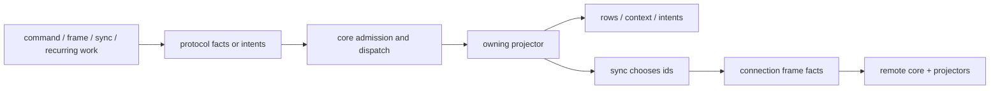

# Protocol

Protocol is the concrete messaging protocol that runs on the reusable core
runtime. Core owns fact storage, projection scheduling, context matching, intent
dispatch, [SQLite](https://www.sqlite.org/index.html) transaction boundaries, daemon turns, and opaque network byte
pumping; see [core/README.md](../core/README.md) for that machinery. Protocol
owns the meaning of bytes: fact layouts, authority checks, encryption domains,
read-model rows, sync visibility, connection handshakes, CLI commands, and
queries.

The protocol is organized by scope rather than by layer. Each scope groups the
fact families, row state, context roles, command adapters, and intent handlers
for one protocol concern. A fact family owns its typed payload, canonical
encoding, authoring helpers, projector-local decode/authenticate/adapt steps,
semantic projection, rows, and queries. The registry wires those families into
core by tag, handler kind, row allowlist, schema source, and recurring work.

## Quickstart

Read these files after the core README:

1. [`registry.rs`](registry.rs): the protocol integration table. It declares fact routes,
   handler routes, recurring work, schema sources, row mutation allowlists, and
   command registration.
2. [`auth/README.md`](auth/README.md): workspace authority, endpoint identity, signatures,
   recipient keys, key wraps, and local key material.
3. [`connection/README.md`](connection/README.md): invite or membership handshakes, sealed connection
   facts, receive observations, established frames, and network-facing intents.
4. [`sync/README.md`](sync/README.md): shareable fact indexing, dependency closure,
   compare/have/need convergence, live-tail sends, and recurring catch-up.
5. [`content/README.md`](content/README.md): encrypted messages, reactions, files, file slices,
   deletion, expiry, retention, and content read models.

## Interface To Core

Protocol supplies core with a `ProtocolDescription`: schema sources, projector
routes, intent handlers, recurring intent builders, command functions,
runtime-turn intake, and a context builder. Core treats those declarations as
opaque. It stores immutable fact bytes by id, routes projection by the first-byte
tag, passes matched context to the owning projector, validates emitted row
mutations against the protocol allowlist, and dispatches queued intent payloads
to registered protocol handlers.

Protocol projectors return complete replacement needs/time wakes, append-only
offers, allowed row mutations, purges, emitted facts, and follow-up intents.
Protocol handlers receive one queued intent plus exact fact inputs and return
`RuntimeEffects`. Neither surface should mutate global runtime state directly.
Commands author facts and read projected rows; they do not update read models,
run projectors, or push network bytes themselves.

Received bytes follow the same path as local facts. Connection projectors open
sealed wire facts into ordinary child facts, core admits those bytes, and the
owning auth, content, connection, sync, or versioning projector decides whether
the fact is valid. Sync can choose which fact ids to send, but it does not
interpret the payloads it transfers.

## Data Flow

Protocol owns every semantic arrow in that graph: what the fact means, which
proofs make it admissible, what rows it materializes, whether it is shareable,
and which dependency facts should travel with it. Core owns the mechanical
transaction and queue boundaries around those arrows.

## Scope Map

- [auth](auth/README.md) owns workspace authority and key material. It proves who
  can act in a workspace, which endpoint or signer is trusted, which recipient
  keys can receive wraps, and which local secrets may open content.
- [content](content/README.md) owns user-visible workspace data. It validates
  encrypted messages, reactions, file descriptors, file slices, deletion facts,
  retention policies, and the read models used by commands and queries.
- [connection](connection/README.md) owns live peer sessions and transport facts.
  It turns invite-backed or membership-backed requests into connection rows,
  opens sealed frames, records receive evidence, and queues opaque bytes for
  core networking. This can be surprising at first: connection facts are also
  the protocol's wire format, providing the handshake and transit-encryption
  layer for all other facts and all network activity.
- [sync](sync/README.md) owns replication planning. It records which admitted
  facts are shareable, computes connection-visible range summaries, exchanges
  compare/have/need facts, expands dependency closure, and asks connection to
  carry selected fact ids.
- [versioning](versioning/README.md) owns protocol storage-version repair. It
  declares the current protocol version, checks the schema marker, and projects
  local update facts that rebuild derived state when storage is stale.

## Auth Fact Families

See [auth/README.md](auth/README.md) for payload fields, example facts, and the
authority/key-material invariants.

- `workspace` creates the shared namespace for users, endpoints, content, and
  sync. It requires workspace-root evidence and local acceptance context before
  it publishes workspace authority.
- `signature` is detached signature evidence over `workspace_id ||
  target_fact_id`. Signer-bearing shared facts consume `signature_proof`
  context before trusting signer fields.
- `user_invite`, `user`, `admin`, `device_invite`, `endpoint_shared`, and
  `invite_server` form the shared authority graph for joining, granting admin
  authority, binding endpoint devices, and authorizing invite-server endpoints.
- `invite_secret` and `invite_accepted` are local bootstrap material. They retain
  invite-link secrets, accepted invite roots, bootstrap peer coordinates, and
  `connection_invite_secret` context used by connection requests.
- `endpoint` and `local_signer_secret` hold local endpoint and signing secrets.
  They publish local context that commands and projectors use to author signed
  facts, seal handshakes, and identify the daemon endpoint.
- `recipient_key` and `local_recipient_key` publish recipient public keys and
  retain matching local private material. Supersession context retires local
  private keys without deleting shared history.
- `removal_frontier`, `local_key_secret`, and `local_history_node_secret` model
  content-key frontiers and retained key-tree nodes. They publish wrap sources,
  local secret sources, and bounded `secret_coverage` for encrypted content.
- `key_request`, `key_wrap`, `key_wrap_creation`, and `key_wrap_recovery` move
  key material between authorized endpoints. Requests and wraps are shared facts;
  creation and recovery are local deterministic work facts that park on context
  until the exact signer, recipient, wrap source, or local recipient proof is
  available.
- `local_secret_retirement` records local policy that a secret source should
  retire. The target secret projector consumes its context and owns row deletion
  or self-purge.

## Content Fact Families

See [content/README.md](content/README.md) for exact projection rules, row
state, purge coordinates, and example fact graphs.

- `message` is encrypted text content. It waits for signature proof, signer and
  author context, local secret coverage, deletion watches, retention floors, and
  expiry wakes before writing message rows and sharing the fact.
- `message_deletion` proves a signed delete claim for one message. It publishes
  `fact_purged` context; the target message projector validates applicability
  and purges itself.
- `reaction` is encrypted content attached to a message. It waits for the parent
  message and deletion context, then writes reaction rows and shares the fact.
- `file` is an encrypted file descriptor attached to a message. It validates
  signer, author, parent message, deletion, and file metadata before writing the
  descriptor row and publishing file context.
- `file_slice` is one BAO-proven encrypted file chunk. It validates the parent
  file descriptor, parent message, signer proof, slice index, and BAO proof
  before writing slice rows.
- `file_deletion` proves deletion for a file descriptor. The target file and
  slice projectors consume that context and clean up their own rows/facts.
- `retention_policy` describes disappearing-message TTL state for a workspace
  or narrower scope. It publishes retention-floor context and shares the policy
  after admin or bootstrap authority is proven.

## Connection Fact Families

Connection is detailed in [connection/README.md](connection/README.md). The
scope has two jobs: establish a live session and carry sealed fact bytes after
the session exists.

Handshake starts with `request`. Bootstrap requests prove an invite path;
membership requests prove existing endpoint membership. The sender creates local
ephemeral material and a sealed request, projection writes retryable request
rows, and `maintain_connections` queues the sealed bytes to the dialed address.
The responder receives opaque TCP bytes through core, `receive_network_frame`
classifies the wrapper as an incoming request fact, and the request projector
waits for local endpoint, ephemeral-secret, invite or membership authority, and
receive metadata. When all proofs match, it emits `create_connection`.

`create_connection` is handler work, not projection. It validates the request,
authority fact, receipt path, and local endpoint row, then emits responder
ephemeral material plus a sealed `connection` fact. The `connection` projector
on each side validates the handshake transcript, writes a live connection row,
offers `connection` context, and emits follow-up work such as
`queue_outgoing_frame` or `seed_connection_sync`. The connection id is the
`connection` fact id; route addresses are connection-scoped and replaced by a
new request rather than mutating durable endpoint state.

Established transfer uses runtime-local frame facts. Sync chooses fact ids and
queues `send_facts_on_connection`; connection loads those facts, rejects
local/private tags, batches the bytes into `frame_small`, `frame_file_slice`, or
`frame_bundle`, seals the frame with the connection secret, resolves the route,
and asks core networking to send the encoded connection-family frame fact bytes
as opaque bytes. The network row does not contain a separate packet type outside
the fact model: the frame itself is the connection fact, and its sealed payload
slot contains the selected child fact bytes. On receipt, each frame projector
needs connection context and receive metadata, opens contained child facts,
stages those bytes as incoming facts, and emits durable `fact_receipt` evidence.
If a frame must park after volatile receive metadata would otherwise disappear,
the projector emits `frame_observation` so replay can restore the receive proof.

Connection families:

- `request` is the global sealed first-contact or reconnect fact. It writes
  retry rows for senders and emits `create_connection` for receivers after
  authority and receive evidence match.
- `connection` is the local sealed response/session fact. It materializes live
  connection rows, offers connection context, and starts sync or response-send
  work after transcript validation.
- `ephemeral_secret` stores local [X25519](https://www.rfc-editor.org/rfc/rfc7748) handshake material and offers it by
  secret id and public key until close context retires it.
- `close` publishes close context for one connection id. Target connection and
  ephemeral-secret projectors own their own row deletion or purge.
- `fact_receipt` is local observational evidence that a semantic fact arrived
  through a request, connection, or established frame path. Receipts do not
  authorize payloads by themselves.
- `frame_small`, `frame_file_slice`, and `frame_bundle` are established encrypted
  frame wrappers for different payload sizes. Each family owns its own fixed
  layout, sealing, opening, receipt emission, and child-fact admission.
- `frame_observation` is durable local receive metadata for a wrapper fact that
  needs to park and later replay with the same origin/receive-time evidence.

## Sync Fact Families

Sync is detailed in [sync/README.md](sync/README.md). The scope chooses which
admitted facts should move across live connections; connection carries the
bytes; receiving projectors validate the payloads. Sync's rows are planning
state, not semantic admission state.

The central input is `share_fact_with_sync`, an intent emitted by owning
projectors after they validate their own fact. The payload names the workspace,
owner fact id, owner timestamp, upsert/retract state, and the direct
`context_have` fact ids the projector actually consumed or validated. The
handler records shareable rows and retained dependency closure. It does not
rediscover dependencies by scanning rows or parsing payload bytes.

Convergence starts when a connection is seeded or recurring `maintain_sync`
finds work under the active local setting. Sync computes a connection-visible
range summary and sends a `compare` fact. The peer compares that summary against
its own visible index. Broad differences become narrower compares; exact
differences become `have_id`; missing exact ids become `need_id`; requested ids
are expanded through retained dependency closure and handed to connection for
sealed transfer. Received bytes then re-enter ordinary fact projection.

Live tail is the latency path. When a share contribution changes an owner,
sync finds established authorized connections that may see it, skips the origin
connection recorded by receipts, expands dependency closure for each remaining
connection, and queues connection send work. Compare/have/need rounds and
recurring catch-up still repair missed sends, disconnected peers, and late
dependencies.

Sync families:

- `shared_fact` is the fact-level exact-id availability signal. It publishes
  `sync_exact_fact` context so a waiting projector can receive a named payload.
  Normal durable visibility is recorded by `share_fact_with_sync`.
- `range_request` names a bounded workspace time range that should become useful
  locally. Current transfer still uses the same range index and dependency
  closure as ordinary connection sync.
- `compare` summarizes one timestamp range on one connection. Projection records
  the peer summary and emits `send_sync_compare_response`.
- `have_id` advertises one exact fact id after summary comparison narrows a
  difference. Projection emits `send_needed_fact_id`, which creates `need_id`
  only when the local store lacks the fact.
- `need_id` requests one exact fact id. Projection emits `send_requested_fact`,
  which checks connection-visible shareability before asking connection to send
  the bytes.
- `local_setting` is a local-only projected setting for recurring sync. It
  selects all-history sync or a bounded timestamp range while still expanding
  chosen owners through dependency closure.

## Versioning Fact Family

See [versioning/README.md](versioning/README.md) for the storage marker, update
loop, and storage-requirement rules.

- `local_update` is the local repair fact. The recurring version check authors
  it when the schema-declared protocol marker is missing or stale; live
  projection records update history, advances the marker, requests version
  replay rebuild, and requeues retained facts for replay. Replaying an old
  update fact is a no-op.

## Invariants

- The registry is declarative. Fact families own payload layout, semantic
  validation, projection policy, rows, and query behavior.
- Context offers are proof locators, not trusted conclusions by themselves. The
  consuming projector still decodes the matched fact and validates that it proves
  the current owner fact.
- Local/private facts must not leave the store. Connection sendability checks
  reject local endpoint material, private auth facts, connection wrapper facts,
  and other non-shared payloads before selected child bytes are framed.
- Projector-emitted sync contributions happen only after the owning fact family
  has accepted its own proof. Sync records the supplied dependency graph; it
  does not infer authority or key dependencies from protocol rows.
- Connection carries bytes and records receive evidence. It does not decide
  whether an opened auth, content, or sync child fact is semantically valid.
- Storage-version repair is protocol-owned. Core enforces declared commit
  guards mechanically, but protocol versioning owns the marker row, repair fact,
  rebuild policy, and compatibility rules.

## Responsibility Boundary

Change protocol when the meaning of a workspace, user, invite, endpoint, key,
message, file, connection, sync range, or version marker changes. Change the
owning fact family when canonical bytes, semantic validation, row shape, context
roles, or authoring/query behavior for that family changes.

Change core only when reusable mechanics change: queue ordering, projection
scheduling, context overlap matching, intent dispatch, transaction boundaries,
row mutation validation, daemon turns, database substrate behavior, or opaque
network byte pumping.
