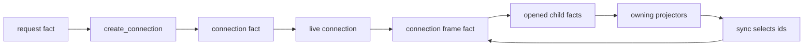

# Connection Fact Scope

Connection is the peer transport and live session scope. We use it to turn an
invite-backed or membership-backed request into a local connection id, receive
opaque network bytes, open sealed frames, record local receive receipts, close
sessions, and ask core networking to move bytes.



## Bootstrap And Membership

There is one `request` fact family. Its fixed-width fields are always present;
`mode` determines whether bootstrap invite proof or endpoint membership proof is
meaningful, and unused fields are zero. Bootstrap mode is first contact with an
endpoint that does not know us yet. Membership mode is a reconnect to an endpoint
that already shares `endpoint_shared` membership with us.

There is one `connection` fact family. The sealed connection is the wire
response authored by the responder and the local connection fact projected by
both parties. Its fact id is the connection id, and projecting it writes one live
connection row. Address fields are connection-scoped route data. If the network
changes, a caller creates a new request with a current address rather than
mutating an existing connection or remembering a durable endpoint address.

## Interface To Core

Data enters core from three places:

- connection commands and auth invite flows create local `ephemeral_secret`,
  `request`, and `close` facts;
- the daemon stages accepted TCP frames in core's raw incoming queue; the
  `receive_network_frame` classifier turns recognized bytes into incoming facts;
- sync and connection handlers queue outgoing frame bytes.

Projection and handlers return incoming child facts opened from established
frames, durable receipt or observation facts for receive metadata, context
offers such as `connection_ephemeral_secret`, `connection_request`,
`connection`, `connection_for_request`, `connection_fact_receipt`,
`connection_closed`, and `connection_ephemeral_secret_closed`, plus local or
durable intents for connection creation, sync seeding, fact batching,
maintenance, and route-resolved outgoing queueing.

Core owns fact storage, incoming byte staging, local-intent removal on
successful handler output, volatile outgoing frame rows, active-address
scheduling through `network_outgoing_targets`, TCP writes, and transaction
boundaries. Connection owns packet classification, route resolution from
requests or connections to socket addresses, handshake transcript checks,
connection secret use, frame sealing/opening, and which child facts may be
emitted from received bytes.

## Managed Row State

Connection owns rows for retryable requests, request-owned bootstrap attempts,
live connections, ephemeral handshake secrets, and fact receipts.
`invite_accepted` rows identify accepted bootstrap peers; the
`bootstrap_connection_attempt_rows` index prevents a maintenance tick from
forking duplicate requests for the same accepted invite. Request rows let
`maintain_connections` resend unanswered requests by queueing their sealed bytes
to the stored peer address. Connection rows let send handlers find the
connection secret and the connection-scoped route. Fact-receipt rows answer local
diagnostics and sync context expansion.

Connection rows are not the cross-scope transport contract. The reusable
interfaces are connection context roles, connection-owned work intents, core's
outgoing queue, and facts carried inside sealed frames.

## Interfaces To Other Scopes

### Context Interface

Auth supplies `auth_local_endpoint`, `connection_invite_secret`, and
`endpoint_shared` context. Accepted invites offer `connection_invite_secret`
under the same derived invite-secret id that creator-side `invite_secret` facts
use, so accepted-side bootstrap does not need a separate retained invite-secret
fact. Request projection consumes invite or membership authority and emits
`create_connection` after it can also emit or match durable receive metadata.
Connection projection consumes request, endpoint or ephemeral-secret, invite
context, and durable receive metadata before offering received connections.
Sealed request and connection headers key local endpoint needs by endpoint id and
ephemeral-secret needs by public key; opened plaintext still validates the
matched secret fact id.
Frame projectors consume `connection` context plus incoming metadata or durable
frame-observation context before opening contained facts back into incoming
projection.

### Other Interfaces

Sync decides which fact ids should be sent on a connection by queuing
connection-owned send work. Connection loads those ids, checks sendability,
batches them into frames, and sends opaque network bytes. The bytes sent for an
established frame are canonical connection-family fact bytes
(`frame_small`, `frame_file_slice`, or `frame_bundle`), with sealed payload slots
that contain the selected child fact bytes. Content, auth, and sync facts can
travel inside established frames only if they are non-local and not tagged as
private/local. Once opened, they are admitted as ordinary child facts and
validated by their owning projectors.

Established frame logic is deliberately flat inside the concrete fact families.
`frame_small`, `frame_file_slice`, and `frame_bundle` each own their fixed
wire construction in `encode.rs`, projector-local decode/auth/adapt helpers in
`project.rs`, construction and sealing in `author.rs`, and receive-side
opening/admission in `project.rs`. There is no shared `connection/frame.rs` or
`connection/frame_wire.rs` layer; duplicated byte handling is preferred over
hiding projector-specific receive semantics behind a generic helper.

Established frames received from the network are incoming projection inputs.
Their projectors consume core-supplied incoming origin metadata or a matched
durable frame-observation fact, and can emit `connection`,
`auth_local_endpoint`, or `connection_ephemeral_secret` needs. If required
context is missing while volatile metadata is present, the frame projector emits
a durable `frame_observation` fact before parking the wrapper. Later projection
reopens the retained frame from that observation context, not from core-retained
metadata. Wire-invalid bytes still drop at the network boundary or during frame
projection. Replay rebuilds retained handshake facts, frame observations,
opened incoming child facts, receipts, and rows; unopened incoming frames that
were retained wait on the same context rules as any other retained fact.

## Cross-Scope Row Reads

Sync reads connection rows when it computes connection-specific visibility and
asks connection to send fact ids. Auth workspace status/reporting code may read
request and connection rows for local diagnostics. Other scopes should use
connection context or connection-owned intents rather than interpreting
connection rows.

## Invariants And Responsibility

Local facts remain local. `ephemeral_secret`, `connection`, `close`,
`fact_receipt`, `frame_small`, `frame_file_slice`, `frame_bundle`,
`frame_observation`, local endpoint facts, and private auth facts are rejected by
frame sendability checks.

In this design, each connection wire fact seals itself in its own layout. The
command path seals a fact for transit when it is generated; inbound bytes are
admitted as that same typed fact. On receipt, a receiving projector unseals it
with the key from a context need: `auth_local_endpoint` for handshake facts and
`connection` for established frames. There is no seal-mode and no separate
envelope fact.

Incoming origin metadata is volatile core-owned local receive metadata for one
received wire fact. It records the observed origin address and local receive
time on the incoming queue/context path. Projectors that need this metadata
after parking emit ordinary local receipt or observation facts; replay restores
origin metadata only by reprojecting those facts.

Receipts are observational evidence. They do not authorize a request,
connection, or child fact by themselves. The target projector validates that the
receipt path, local endpoint, sender endpoint, request id, connection id, and
frame hash match the target fact.

Close is target-owned. A close fact publishes close context. The connection and
ephemeral-secret projectors consume it and delete or purge their own rows and
facts.

## Runtime Work

`receive_network_frame` is the inbound byte classifier. Core owns the raw
incoming queue and origin metadata; the classifier only stages sealed `request`,
sealed `connection`, or established-frame bytes as typed incoming facts. It does
no unsealing itself and does not decide retention; the owning projector decides
whether the incoming fact is kept as durable evidence or deleted after
projection. It is called by the daemon's inbound network drain, not through a
queued intent.

`maintain_connections` drives outbound request sends from retryable request
rows. The request command creates invite or membership authority, initiator
ephemeral material, and the exact sealed request fact. Maintenance queues
unanswered sealed request bytes directly into core's `network_outgoing` table
for the row's peer address.

`create_connection` is responder-side handshake work. It loads the request,
authority fact, receive receipt, and local endpoint row, validates the bootstrap
or membership proof and receipt path, creates responder ephemeral material, and
returns responder `ephemeral_secret` plus sealed `connection`. It sends nothing
itself; connection projection emits the local `queue_outgoing_frame` intent after
the connection fact is admitted.

`send_facts_on_connection` packages facts chosen by sync. It loads the
connection and payload facts, rejects local/private facts, batches small facts
or file slices into frame classes, seals each batch with the connection secret,
resolves the connection row to a peer address, and queues outgoing frame bytes
directly into core's `network_outgoing` table.

`queue_outgoing_frame` is the route-resolving bridge used when projection has
sealed bytes but cannot mutate the core network queue directly. It resolves a
connection row to a peer address, validates frame size, and stages opaque bytes
in the core `network_outgoing` frame queue. Missing route state drops the stale
local send attempt with no effects. TCP reachability and backpressure are core concerns: the daemon pump
schedules active addresses from `network_outgoing_targets`, drains per-target frame
rows, and leaves rows queued when a target cannot accept bytes.

## Facts

### `request` (tag 48)

Global sealed request. Bootstrap mode carries invite proof; membership mode
carries endpoint membership proof. Sender projection writes a retryable request
row; receiver projection waits for local endpoint, incoming metadata, and
authority context, then emits `create_connection`.

```text
request {
  mode: bootstrap
  from_endpoint: x25519:alice_phone
  to_endpoint: x25519:bob_laptop
  dialed_addr: "198.51.100.20:41000"
  invite_fact_id: fact:user_invite_alice
  invite_secret_fact_id: fact:invite_secret_scoped
  initiator_ephemeral_secret_fact_id: fact:ephemeral_alice
}
```

### `connection` (tag 49)

Local sealed connection fact. Projection on either side validates the referenced
request and handshake transcript, writes `connection_rows`, offers
`connection`, and emits sync seed or send work as appropriate. The fact id is the
connection id.

```text
connection {
  from_endpoint: x25519:bob_laptop
  to_endpoint: x25519:alice_phone
  request_id: fact:request_alice_to_bob
  responder_addr: "198.51.100.20:41000"
  initiator_addr: "203.0.113.10:41000"
  responder_ephemeral_secret_fact_id: fact:ephemeral_bob
  connection_secret: secret:connection_aead_key
}
```

### `ephemeral_secret` (tag 43)

Local X25519 handshake secret. Projection requires local scope and public/private
key consistency, writes `connection_ephemeral_secret_rows`, offers
`connection_ephemeral_secret` by fact id and
`connection_ephemeral_secret_public_key` by public key, and deletes/purges
itself when close context names it.

### `close` (tag 45)

Local close signal for one connection id. Projection requires local scope and
`connection` context, then offers `connection_closed` for the connection id.

### `fact_receipt` (tag 164)

Local observation record for a semantic fact received over a request,
connection, or established frame path. Projection offers
`connection_fact_receipt` keyed by `received_fact_id` and writes
`connection_fact_receipt_rows`.

### `frame_small` (tag 168)

Runtime-local wire fact for one established small encrypted frame. Projection
needs incoming origin metadata plus the referenced local `connection`, opens the
frame, emits contained facts back into incoming projection, and emits one
durable receipt per child. Its
`encode.rs` plus projector-local `decode` module are the complete
canonical byte layout for this size class; `author.rs` seals outbound frames;
`project.rs` opens inbound frames.

### `frame_file_slice` (tag 169)

Runtime-local wire fact for an established frame sized for one content
file-slice fact. It uses the same projection path as `frame_small` but the frame
layout has a larger fixed ciphertext slot.

### `frame_bundle` (tag 170)

Runtime-local wire fact for an established bundled frame. Projection opens the
bundle and admits each contained fact with a receipt.

### `frame_observation` (tag 173)

Durable local receive metadata for one request, connection, or established frame
wrapper fact. Projectors emit it when an incoming wire fact must park before it
can emit final receipts; projection offers `connection_frame_observation` keyed
by `frame_fact_id`.

## Example Fact Graph

```text
outbound initiator:
  invite_secret or endpoint_shared + ephemeral_secret
    -> sealed request
    -> request row
    -> maintain_connections
    -> network_outgoing

inbound responder transport observation:
  sealed request bytes
    -> receive_network_frame
    -> incoming request with origin metadata

inbound responder dependency graph:
  request
    needs auth_local_endpoint(to_endpoint)
    needs connection_ephemeral_secret_public_key(initiator_ephemeral_public_key)
    needs connection_invite_secret(invite_secret) or endpoint_shared
    -> connection_fact_receipt(request) local receive proof
    -> create_connection(request, authority, receipt)

create_connection
  -> responder ephemeral_secret + sealed connection

connection projector on responder:
  needs request + responder ephemeral_secret + authority
  -> connection row + connection offer
  -> queue_outgoing_frame(sealed connection)

inbound initiator transport observation:
  sealed connection bytes
    -> receive_network_frame
    -> incoming connection with origin metadata

connection projector on initiator:
  needs request + initiator ephemeral_secret + incoming metadata
  -> connection row + connection offer
  -> seed_connection_sync

established connection transfer:
  sync selected facts
    -> send_facts_on_connection
    -> network_outgoing
    -> remote frame_small/frame_bundle/frame_file_slice
    -> remote incoming frame with origin metadata
       needs incoming metadata + connection
       open to incoming child facts + durable fact_receipts
```
