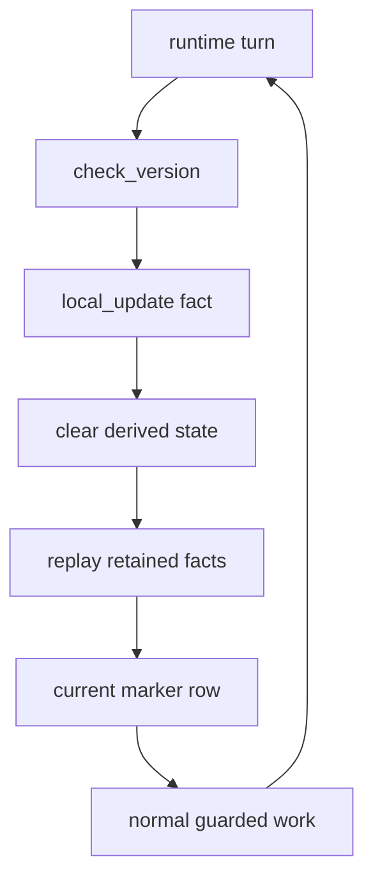

# Versioning

`versioning` is a protocol scope. It is not itself a fact family.

This scope owns the release constant `CURRENT_PROTOCOL_VERSION`, the recurring
check that compares the schema-declared protocol marker with that constant, and
the local update fact that repairs stale derived state. Core owns the generic
commit-side `StorageRequirement` guard; see `src/core/README.md` for that
runtime contract.

## Rules

1. A release must not author a new durable fact type until every non-deprecated
   release can decode, authenticate, validate, and project that type.
2. Projectors for current code must support every old durable fact type that can
   remain in `facts`.
3. New projectors and queries must not write old materialized table shapes.
4. Commands, projectors, handlers, and queries declare the storage version they
   expect before they touch materialized state.
5. If code advances past the stored database marker, normal paths run a bounded
   turn and remain guarded until repair completes; stale selected queue rows are
   consumed without ordinary effects instead of writing old-shape state.
6. Version repair is the recurring update loop described below.

## Layout

- `src/protocol/versioning.rs` owns `CURRENT_PROTOCOL_VERSION` and the scope
  map.
- `src/protocol/versioning/check_version.rs` owns the recurring
  `check_version` intent that authors update facts when the schema-declared
  protocol marker is stale.
- `src/protocol/versioning/local_update.rs` owns the `local_update` fact
  family, its projected protocol-visible update row, and the `state-summary`
  diagnostic.
- `src/protocol/versioning/local_update/queries.rs` owns state-summary
  diagnostics.

The actual fact family is `versioning/local_update/`. Its role files
(`fact.rs`, `encode.rs`, `author.rs`, `project.rs`, `api.rs`, `cli.rs`) stay
under that directory. `state-summary` is a diagnostic command owned by the
local-update family. It hashes schema-declared summary tables so version replay
rebuild output can be compared without adding protocol meaning to core.

## Update Loop

The update loop is protocol responsibility. It answers one question: has this
database already projected retained facts into the materialized shape expected
by this checkout?

`CURRENT_PROTOCOL_VERSION` is the compile-time release constant in
`src/protocol/versioning.rs`. It is the target version for the materialized
storage shape this binary expects. It is not read from the database.

The stored version marker is `protocol_version_rows.protocol_version`, ordered
by `applied_at_ms` and `update_fact_id` so the latest marker row wins. The
protocol schema's `StorageVersionSource` tells core where to read that marker;
the marker itself is protocol-owned projected state. A fresh database has no
marker row until the update loop creates one. Missing and stale markers both
mean this database needs a local update fact.

The recurring update path is concrete:

1. Each bounded runtime turn gives recurring builders an opportunity. The daemon
   loops the same turn with network adapters; commands and queries run it
   without durable handler dispatch, listener, or outgoing adapters before
   dispatch.
2. The `check_version` builder reads the stored marker and compares it with
   `CURRENT_PROTOCOL_VERSION`. If they match, it queues no intent. If the
   marker is stale or missing, it queues `check_version`.
3. The `check_version` handler repeats the same check before committing effects.
   If the marker is now current, it emits no work. If it is still stale or
   missing, it creates a priority local update fact for `CURRENT_PROTOCOL_VERSION`.
4. Live projection of that update fact requests the version replay rebuild
   effect and commits the wipe/replay boundary. In that same projection commit,
   it records
   protocol-visible update history, advances the schema-declared marker by
   inserting a `protocol_version_rows` row, clears schema-declared resettable
   derived/runtime state, preserves retained facts and other replay-protected
   tables, and queues all retained facts in `pending_projection` with replay
   mode set.
5. After that commit, the same runtime turn drains replay projection and replay
   intent work like normal queued work. The storage-requirement guards above
   keep ordinary work from committing stale materialized state while repair is
   pending. Retained facts are requeued by version replay rebuild, while queued
   intents remain droppable across upgrade.

The update fact is retained as history, but its projector does wipe/replay work
only during live projection. Replay projection of an old update fact is a no-op,
so previous updates do not rerun that repair.

## Storage Requirements

A storage requirement is a local safety contract for one read or write path. It
is separate from the recurring update loop.

Protocol projectors and handlers register `StorageRequirement::Current` for
ordinary work. Core enforces that requirement inside the same SQL transaction
that would otherwise commit the effects. On mismatch, core consumes the selected
projection or intent row without ordinary effects. Handlers do not run under a
stale marker, and projection effects are not published. The versioning update
projector and handler use `StorageRequirement::MaintenanceBypass` so repair can
run while storage is stale.

Queries are direct SQL readers, so core does not gate them automatically the way
it gates projection and intent commits. Before touching materialized tables, a
query must choose one explicit behavior: require the current storage version
and return a mismatch error, intentionally support an old not-yet-replayed
table shape with compatibility SQL, or act as a maintenance/diagnostic query
that is allowed to inspect stale state. The normal user-facing path should
require current storage unless the query documents a specific stale-storage
compatibility path.

## Boundaries

Core does not know release policy, fact-family compatibility, or table meaning.
It reads the schema-declared protocol marker, enforces the storage requirement
it is handed, and executes version replay rebuild/update effects mechanically.

Protocol modules own the marker table, version number, recurring check, update
fact, query policy, and per-family compatibility rules. Compatibility with
older retained facts or older materialized storage belongs in the owning
projector/query code. During an update, that code may read old storage shapes
only to derive the current release's state; it must write only the current
release's declared tables and effects, never old database tables.

Core also does not store future-version incoming facts as protocol truth.
Incoming is volatile intake. Fact storage happens only after admission and
projection.
